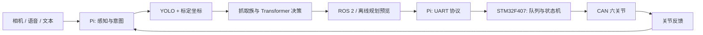

# 小U（XiaoU）视觉具身桌面机器人

小U是一个面向桌面整理与取放演示的六轴机器人工程。仓库把树莓派视觉与交互、ROS 2 离线规划、STM32F407 运动控制和可复现实验放在同一套源码中，便于在没有硬件时进行验证，也便于在硬件到位后按阶段联调。

> 本仓库默认只做离线计算、仿真、协议编解码和只读诊断。真实运动必须由操作者在已标定设备上显式触发，且不由 CI、脚本安装或示例命令自动执行。

## 工程能力

| 层级 | 已纳入内容 |
| --- | --- |
| 感知 | OpenCV DNN/ONNX YOLO、多模型注册、类别约束、图像坐标处理 |
| 决策 | Transformer 策略训练/量化/ONNX 回放接口，抓取族与示教记录管理 |
| 规划 | 六轴 POE 运动学、阻尼 IK、五次轨迹、预抓/抬升/转运/下降路径生成 |
| ROS 2 | 描述模型、网格、MoveIt 配置、感知/决策/规划/控制包与离线启动文件 |
| 执行 | Pi–F407 UART 帧、CRC 与转义、轨迹队列、关节反馈、CAN 协议工具 |
| MCU | STM32F407 + RT-Thread + Keil 工程，六轴状态、轨迹、急停与诊断接口 |
| 交互 | 小U表情、状态面板、语音/文本入口与任务编排接口 |

## 系统链路



`raspberry_pi` 是 Python 工程根目录；模型、运行时资产、ROS 2 工作区和测试均在其中，因此执行 Pi 侧命令前请先进入该目录。

## 快速开始：离线验证

需要 Python 3.10+。以下命令不连接串口、不启动相机，也不会向机械臂发送动作。

```bash
git clone https://github.com/1830051801-ux/xiaou-vision-robot-arm.git
cd xiaou-vision-robot-arm/raspberry_pi
python -m venv .venv
. .venv/bin/activate              # Windows PowerShell: .venv\Scripts\Activate.ps1
python -m pip install -U pip
python -m pip install -r requirements-dev.txt
python -m unittest discover -s tests -v
python tools/verify_six_axis_stack.py
```

在仓库根目录还可以运行发布结构检查：

```bash
python scripts/verify_release.py
```

## 目录

```text
raspberry_pi/
  robot_ai/                 感知、决策、六轴规划、UART、交互
  tools/                    离线回放、仿真、数据与部署工具
  tests/                    纯软件单元与接口测试
  simulation/               桌面场景和策略训练用模拟环境
  ros2_ws/src/              ROS 2 / MoveIt / 机械模型源码
  models/                   发布随附的 YOLO ONNX 模型
  runtime/                  少量可复现的 INT8 策略与验证资产

stm32_keil/
  BasicSetting_DaRanRobot/  STM32F407 Keil + RT-Thread + CAN 工程

docs/                       架构、部署、模型、ROS 2 与参考协议资料
scripts/                    发布完整性检查
media/                      演示素材
```

## 重要说明

- `raspberry_pi/codex_pickup_package/workspace_homography.yaml` 是历史回归样本，用于验证投影算法；它不是新相机的可用标定。更换相机、支架、桌面或机械臂基座后必须重新标定。
- `hardware_calibration.json` 与候选标定配置在提交状态下保持运动锁定，供离线测试、协议回放和配置格式参考。不要把别人的零位、限位或方向参数直接用于自己的机械臂。
- `tools/teach_grasp_execute.py` 含真实执行入口，但仅在 `--execute`、确认口令、现场反馈和显式硬件确认全部满足时尝试通信；它不是演示或 CI 命令。
- 训练集、原始抓取记录、树莓派运行目录、Keil 构建产物、固件二进制和本地密钥不会提交到公开仓库。

## 文档入口

- [系统架构](docs/ARCHITECTURE.md)
- [离线验证与 CI](docs/VALIDATION.md)
- [ROS 2 与离线仿真](docs/ROS2.md)
- [模型、量化与数据接口](docs/MODELS.md)
- [硬件上机与联调边界](docs/HARDWARE_BRINGUP.md)
- [STM32F407 / Keil 工程](stm32_keil/README.md)

## 许可证

当前未附带开源许可证。未经权利人书面许可，不授予复制、再分发或商用授权。
