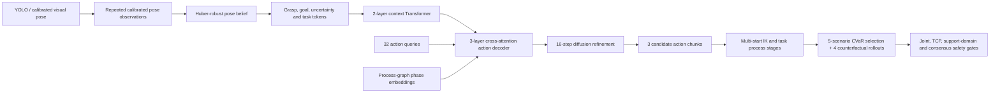

# XiaoU Process-Graph Multi-Task Digital Twin

An offline six-axis manipulation benchmark that connects visual target handoff, process-graph-conditioned action-chunk generation, counterfactual safety consensus, kinematic projection, ROS 2 planning artifacts, and explicit hardware execution gates for the XiaoU desktop arm.


## Verified Capabilities

- **Five task profiles**: transfer, two simulated placement zones, two-view inspection, and precision insertion with final dwell.
- **Process-Graph Action-Chunk Transformer**: visual grasp pose, place goal, uncertainty metadata, a five-way task profile, and a learned task token are fused by a two-layer Transformer encoder. Each action step also receives an explicit process phase embedding: home, approach, contact, transfer, retreat, or dwell.
- **Proposal-guided diffusion**: a learned action-chunk proposal is refined over 16 denoising steps rather than sampling an unstructured joint trajectory from noise.
- **Kinematics-grounded process stages**: each trajectory contains approach, contact, transfer, retreat, and task-specific dwell phases. Approach poses are created by Cartesian vertical offsets and solved with multi-start damped least-squares IK.
- **Safety projection and abstention**: joint envelopes, visual-support distance, sample dispersion, task-region checks, IK recovery, and TCP clearance against table/fixture keep-out boxes gate every offline preview.
- **Counterfactual safety consensus**: four re-observations consistent with declared sensor noise are independently sent through policy inference and the kinematic shield. A preview is accepted only when at least 75% of the rollouts are projected safe.
- **Belief-space Scenario-CVaR selector**: five calibrated pose observations are fused with a Huber-robust base-frame translation/relative-yaw belief; three diffusion action chunks are then screened across the observation scenarios and ranked by safety coverage, lower-tail CVaR clearance, joint travel, and acceleration. The support gate retains the original declared sensor scale, so averaging observations cannot hide an OOD camera condition.

## Technical Highlights

- **Process-graph embodied policy**: five process templates use explicit home, approach, contact, transfer, retreat, and dwell phases instead of treating every task as a single point-to-point IK command.
- **Action-Chunk Transformer with proposal-guided diffusion**: a two-layer context encoder and three-layer cross-attention decoder generate complete `32 x 6` joint chunks, then refine them over 16 denoising steps.
- **Object-centric visual geometry interface**: grasp pose, placement goal, confidence, and uncertainty remain separated from task semantics. This is a clean integration boundary for future VLM/VLA intent parsing, while the checked-in benchmark remains honest about using calibrated poses rather than raw RGB or language.
- **Kinematics-grounded digital twin**: the six-axis POE model is cross-checked against ROS 2 URDF data, with multi-start bounded IK, process-stage reconstruction, and TCP keep-out review in the same offline loop.
- **Domain-randomized embodied data**: balanced five-task training uses noise, confidence, placement-region, and process-template variation; nominal and high-noise OOD splits make robustness and refusal behavior measurable.
- **Belief-space planning**: repeated pose observations, robust outlier down-weighting, diffusion candidate selection, and lower-tail clearance scoring make the planner reason over uncertainty instead of only one detected point.

## Reproducible Multi-Task Benchmark

The checked-in dashboard was generated on the local CUDA environment with a 1,321,478-parameter `hidden_dim=128` process-graph policy.

| Split | Episodes | Task balance | Visual condition |
| --- | ---: | --- | --- |
| Train | 4,096 | 820 transfer, 819 each remaining task | Per-episode domain randomization: 0.55-1.45x base noise; confidence 0.68-0.99 |
| Nominal test | 640 | 128 per task | XY 3 mm, Z 2 mm, yaw 2 deg |
| OOD test | 640 | 128 per task | XY 8 mm, Z 4 mm, yaw 5 deg |

| Nominal metric | Result |
| --- | ---: |
| Raw-policy mean grasp endpoint error | 6.35 mm |
| Constraint-projected mean grasp endpoint error | 4.18 mm |
| Projected-safe coverage across all tasks | 82.34% |
| Four-rollout counterfactual consensus rate | 78.75% |
| High-noise OOD abstention across all tasks | 100.00% |

The projected-safe rate is deliberately not presented as a real-arm success rate. It is the fraction of offline episodes that pass the checked-in task, IK, and TCP scene gates after a synthetic visual observation.

## Belief-Space Stress Result

The following secondary run uses a deterministic balanced subset of **100 offline episodes (20 per task)**. It injects a 20% synthetic outlier probability into four additional pose observations, so the robust-fusion and risk-selection path is evaluated under a stricter condition than the primary single-view benchmark.

| Belief-space metric | Result |
| --- | ---: |
| Primary mean grasp/place pose error | 4.47 mm |
| Huber-fused mean grasp/place pose error | 2.51 mm |
| Pose-error reduction | 43.78% |
| High-confidence plan acceptance | 63.00% |
| Mean scenario-safe fraction of accepted plans | 93.33% |
| Mean lower-tail CVaR TCP clearance margin | 44.49 mm |
| Selected-plan mean grasp endpoint error | 2.54 mm |
| High-noise OOD abstention (100 balanced episodes) | 100.00% |

The 63% acceptance rate is intentionally lower than ordinary single-view projection coverage: the selector abstains when no diffusion proposal remains safe in at least 75% of the five re-observation scenarios. This is an offline robustness result, not a physical success rate or a claim that the simulator has calibrated multi-camera hardware.

## Simulation Evidence

- Six-axis POE model is checked against the ROS 2 URDF: maximum screw-axis error `3.97e-9`, maximum home-transform error `1.00e-12`.
- ROS 2 workspace includes robot description, collision/visual meshes, MoveIt configuration, perception entry points, and review-only launch paths.
- MoveIt trajectory execution and the planner execution path remain disabled until measured calibration, limits, feedback, emergency stop, and explicit authorization exist.



## Quick Start

Core offline verification:

```powershell
python -m unittest discover -s tests -v
python -m compileall -q robot_ai tests tools
python tools\verify_six_axis_stack.py
```

Reproduce the multi-task benchmark using a Python environment with PyTorch, NumPy, and Matplotlib:

```powershell
powershell -ExecutionPolicy Bypass -File .\tools\run_constraint_diffusion.ps1
```

Generated datasets, checkpoints, and reports remain under `runtime/` and are intentionally ignored by Git. The public benchmark dashboard is `assets/multitask_factory_cell_dashboard.png`.

For the checked-in balanced stress configuration without retraining:

```powershell
& 'D:\EmbodiedAI\mujoco-venv\Scripts\python.exe' tools\constraint_diffusion_twin.py evaluate `
  --checkpoint runtime\constraint_diffusion\process_graph_multitask_action_chunk_transformer_policy.pt `
  --dataset runtime\constraint_diffusion\multitask_test.npz `
  --output runtime\constraint_diffusion\belief_stress.json `
  --episodes-per-task 20 --counterfactual-rollouts 4 `
  --belief-views 5 --belief-candidate-count 3 `
  --belief-outlier-probability 0.20 --belief-minimum-safe-fraction 0.75
```

## Explicit Limits

This is an ACT-style action-chunk design for calibrated visual geometry. It is not a pretrained VLA, does not consume raw RGB or language instructions, and is not a certified industrial control system. The belief-space benchmark synthesizes repeated pose observations from the clean simulation state only to measure robustness; a live system must instead supply independently calibrated visual pose estimates. The digital twin uses the checked-in POE model and TCP-only scene review; full-link collision, calibrated camera-to-base transforms, measured encoder offsets, force feedback, and real-arm validation remain required before physical motion.

## Documentation

- [Chinese project guide](README_使用说明.md)
- [Multi-task Transformer experiment note](docs/constraint_diffusion_digital_twin.md)
- [Belief-space safety-layer design and evidence](docs/belief_space_safety_layer.md)
- [Six-axis simulation review](docs/simulation_review_20260807.md)
- [ROS 2 planning workspace](ros2_ws/)
