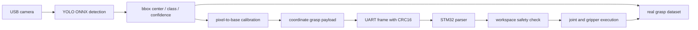

# XiaoU Vision Robot Arm

Raspberry Pi vision pipeline and STM32/Keil firmware for a coordinate-driven desktop robot arm.

The Raspberry Pi detects a target object from a USB camera, converts the image position to base-frame coordinates, and sends a binary grasp command to the STM32 controller. The STM32 parses the UART frame, checks the reachable range, converts the target coordinate to joint motion, and drives the arm joints and gripper.

## Highlights

| Area | Implementation |
| --- | --- |
| Perception | YOLO ONNX target detection on Raspberry Pi |
| Calibration | Pixel center to robot base-frame coordinate conversion |
| Communication | UART binary protocol with CRC16 and byte escaping |
| Control | STM32 coordinate parser, safety check, joint/gripper execution |
| Data | Real grasp image, bbox, coordinate and action logs for simulation training |
| Extension | Can be used as a real-data source for behavior cloning and Real2Sim2Real experiments |

## Current Test Snapshot

| Metric | Result |
| --- | --- |
| Object categories | 10 classes supported by the deployed detector set |
| Detection speed | About 22 FPS on the Raspberry Pi runtime |
| Detection accuracy | About 94% on the project test set |
| Coordinate calibration error | Less than 1.5 mm average positioning error |
| UART packet loss | Less than 0.5% in local joint-debug tests |
| Real grasp logs | 100+ grasp trajectories and visual records collected |

## System Pipeline



This project is coordinate driven. The Raspberry Pi sends pick/drop coordinates and a gripper profile. The STM32 firmware does not choose actions from fixed object task numbers.

## Demo

Demo media is stored in:

```text
media/demo.mp4
```

The recorded workflow shows the real system path: camera detection, coordinate generation, UART transmission and robot-arm grasp execution.

## Repository Layout

```text
raspberry_pi/
  robot_ai/                 Camera, YOLO, calibration, UART payload code
  scripts/                  Raspberry Pi setup and run scripts
  config.env.example        Runtime configuration template
  requirements.txt          Python dependencies

stm32_keil/
  BasicSetting_DaRanRobot/  Keil MDK STM32F407 firmware project
    Inc/                    Application headers
    Src/                    UART parser, motion, calibration and control code
    Device/                 DrEmpower CAN motor driver
    MDK-ARM/                Keil project files

models/                     ONNX detection models and class-name sidecars
media/                      Demo media
docs/                       Setup, calibration and protocol notes
```

## Hardware

- Raspberry Pi with USB camera
- STM32F407 controller board
- USART1 between Raspberry Pi and STM32: PA9/PA10, 115200 8N1
- CAN motor bus on STM32 CAN1: PA11/PA12
- PWM gripper servo connected through the STM32 firmware

## Raspberry Pi Run

```bash
cd ~/raspi_robot_ai
python3 -m venv --system-site-packages .venv
. .venv/bin/activate
pip install -r requirements.txt
cp config.env.example config.env
```

Dry run detection and payload generation:

```bash
bash scripts/run_demo_all.sh --object pen
```

Send the detected coordinate frame to STM32:

```bash
bash scripts/run_demo_all.sh --object pen --send-serial
```

Useful checks:

```bash
bash scripts/run_system_check.sh
bash scripts/run_camera_test.sh
bash scripts/run_yolo_test.sh
bash scripts/run_uart_test.sh
```

## STM32 / Keil

Open the firmware project in Keil:

```text
stm32_keil/BasicSetting_DaRanRobot/MDK-ARM/BasicSetting_DaRanRobot.uvprojx
```

Main integration points:

- `Src/main.c`: UART frame parsing and coordinate grasp execution
- `Src/comm_protocol.c`, `Inc/comm_protocol.h`: frame parser and command IDs
- `Src/arm_kinematics.c`, `Inc/arm_kinematics.h`: arm geometry helpers
- `Src/trajectory_planner.c`, `Inc/trajectory_planner.h`: trajectory generation
- `Device/src/DrEmpower_can.c`: CAN motor command layer
- `Src/servo.c`, `Inc/servo.h`: gripper servo control

## Coordinate Command

`CMD_GRASP_MOVE = 0x14`

Payload is 20 bytes:

| Field | Type | Unit |
| --- | --- | --- |
| pick_x | int16 | mm x10 |
| pick_y | int16 | mm x10 |
| pick_z | int16 | mm x10 |
| pick_yaw | int16 | deg x10 |
| drop_x | int16 | mm x10 |
| drop_y | int16 | mm x10 |
| drop_z | int16 | mm x10 |
| drop_yaw | int16 | deg x10 |
| safe_z | int16 | mm x10 |
| grip_id | uint8 | gripper index |
| grip_profile | uint8 | gripper close/open profile |

Frame format:

```text
[0xAA][CMD][LEN][SEQ][PAYLOAD][CRC16_LO][CRC16_HI][0x55]
```

Payload bytes are escaped when they equal `0xAA`, `0x55`, or `0xBB`. CRC is CRC-16/MODBUS over command, length, sequence and unescaped payload.

## Data Logging

The project is structured so real robot attempts can be reused by simulation and policy-training projects. A typical grasp record should contain:

```text
image frame
detected class
bbox center
base-frame x/y coordinate
pick/drop payload
STM32 response
joint/gripper command
success flag
failure reason
```

Those records can be exported to the EmbodiedArm simulation project for behavior cloning, rollout validation and Real2Sim2Real experiments.

## Teleoperation Data Collection

The coordinate-driven command format can also be used for expert demonstration collection. A manual or remote operator can send target coordinates, execute a grasp, and store the resulting image, coordinate, command and success label as one episode. This makes the real robot project a data source for imitation learning rather than only a fixed demonstration system.

## Calibration

The Pi-side homography file is expected at:

```text
raspberry_pi/runtime/calibration/workspace_homography.yaml
```

Run calibration again after moving the camera, camera mount, work surface, arm base or marker board. The detector can still produce boxes without calibration, but the STM32 command needs stable base-frame coordinates.
