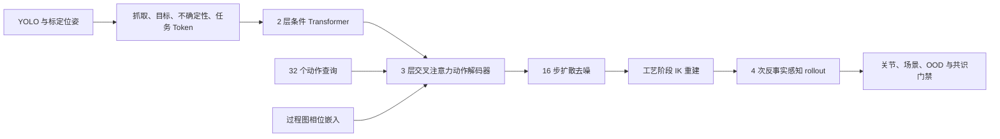

# XiaoU 过程图多任务数字孪生

这是一个面向桌面六轴机械臂的离线多任务操作仿真工程。项目将视觉目标坐标、过程图条件、Action-Chunk Transformer、反事实安全共识、扩散轨迹生成、POE/URDF 运动学核验、ROS 2 规划入口和硬件执行门禁放在同一条可审计链路中。默认只生成离线规划和验证报告，不会连接或驱动真实机械臂。


## 核心设计

- **多任务条件化**：覆盖转运、两个仿真分拣区、双视角检查和精密插入五类任务。任务类别作为 five-way profile token 输入模型，而不是把不同工艺轨迹混合训练。
- **过程图 Action-Chunk Transformer**：抓取位姿、放置目标、观测不确定性、任务 profile 和可学习任务 token 经两层 Transformer 编码；每个动作步还显式编码 `home / approach / contact / transfer / retreat / dwell` 工艺相位，三层交叉注意力解码器一次输出 `32 x 6` 六轴关节动作块。
- **工艺阶段轨迹**：每条示教均含接近、接触、转运、撤离等阶段；精密插入任务额外保留末端驻留。接近点由末端 Z 向偏移生成，再通过多初值阻尼最小二乘 IK 求解。
- **扩散策略**：以动作块先验开始进行 16 步去噪细化，避免直接由无结构的随机关节噪声输出轨迹。
- **安全投影**：训练支持域、样本离散度、任务区域、关节范围、多初值 IK 和桌面/夹具 TCP 净空共同决定“离线可预览、需复检或拒绝”。
- **反事实安全共识**：对同一视觉观测按声明噪声构造 4 个重观测，分别进行策略推理和运动学投影；只有至少 75% 的 rollout 通过，才输出共识预览。

## 已复现实验

正式模型使用 `hidden_dim=128`，共有 1,321,478 个可训练参数。使用固定随机种子完成如下离线基准：

| 数据集 | 样本数 | 配置 |
| --- | ---: | --- |
| 训练集 | 4,096 | 转运 820 条，其余四类各 819 条；逐样本噪声 0.55-1.45 倍随机化，置信度 0.68-0.99 |
| 正常噪声测试集 | 640 | 每类任务 128 条，XY 3 mm、Z 2 mm、yaw 2 deg |
| 高噪声 OOD 测试集 | 640 | 每类任务 128 条，XY 8 mm、Z 4 mm、yaw 5 deg |

| 指标 | 结果 |
| --- | ---: |
| 原始策略抓取端点平均误差 | 6.35 mm |
| 约束投影后抓取端点平均误差 | 4.18 mm |
| 五类任务总体投影安全覆盖率 | 82.34% |
| 四次反事实 rollout 共识接受率 | 78.75% |
| 高噪声 OOD 输入拒绝率 | 100.00% |

逐任务反事实共识接受率：转运 79.69%、分拣区 A 83.59%、分拣区 B 71.88%、检查扫描 78.13%、精密插入 80.47%。这些是由已纳入工程的 POE 模型、合成视觉噪声和 TCP 场景审查得到的离线结果，不代表真机抓取成功率。

## 仿真能力证据

- 六轴 POE 模型与 ROS 2 URDF 的最大螺旋轴误差为 `3.97e-9`，home 变换误差为 `1.00e-12`。
- ROS 2 工作空间包括 8 个视觉网格、8 个碰撞网格、MoveIt 配置、感知节点、规划节点和 review-only 启动路径。
- 规划输出会通过任务区域、IK、关节范围和 TCP 净空审查；MoveIt 与规划执行开关均保持关闭，避免离线结果绕过真实硬件授权。



## 运行方式

基础离线验证：

```powershell
python -m unittest discover -s tests -v
python -m compileall -q robot_ai tests tools
python tools\verify_six_axis_stack.py
```

复现实验：

```powershell
powershell -ExecutionPolicy Bypass -File .\tools\run_constraint_diffusion.ps1
```

训练数据、模型检查点和评估 JSON 写入 `runtime/`，不会提交到 GitHub；公开结果图位于 `assets/multitask_factory_cell_dashboard.png`。

## 边界说明

当前项目参考了具身策略的动作块思想，但输入是已标定的视觉几何量，不是原始 RGB、语言指令或预训练 VLA。它不是已通过产线验证的工业控制系统。进入真机前仍需完成相机到基座标定、全连杆碰撞模型、关节零位/方向/限位/反馈测量、急停与夹爪/力反馈验证，并取得明确授权。
