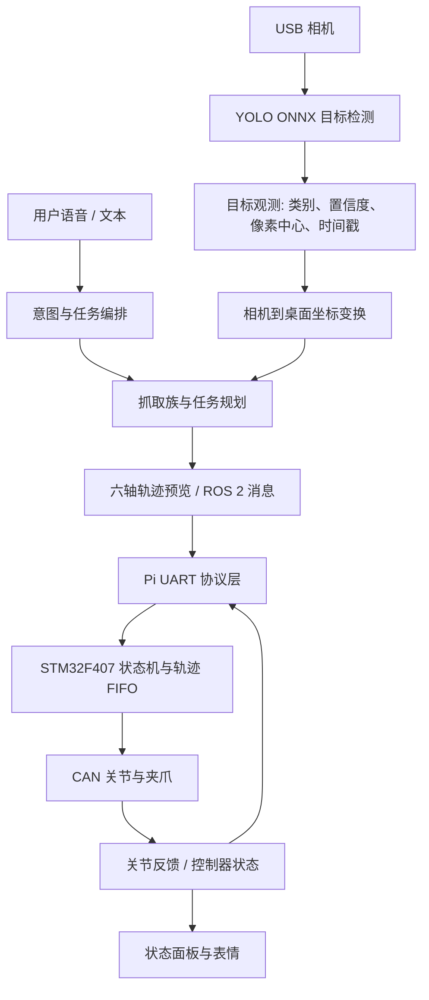

# 系统架构

小U的工程目标是把“看见目标、判断是否可处理、生成可解释的抓取预览、通过可靠协议交给控制器”拆成可单独验证的层。每一层都有明确输入和失败出口，避免把视觉结果直接当成电机命令。

## 模块边界

| 模块 | 目录 | 责任 | 不负责的事情 |
| --- | --- | --- | --- |
| 感知与交互 | `raspberry_pi/robot_ai/` | YOLO、语音/文本、表情、状态展示 | 不直接控制 CAN 电机 |
| 决策 | `robot_ai/decision/` | 观测契约、Transformer 训练/回放、ONNX 推理 | 不以模型输出绕过硬件校验 |
| 运动学与抓取 | `robot_ai/arm_control/` | POE FK/IK、轨迹、示教记录、抓取族、UART 编解码 | 不假设未测量的零位或限位 |
| 仿真 | `simulation/` | 桌面场景、策略数据、离线回归 | 不替代实机标定 |
| ROS 2 | `ros2_ws/src/` | 描述、MoveIt、感知/决策/规划接口 | 不在离线启动中输出物理动作 |
| F407 固件 | `stm32_keil/BasicSetting_DaRanRobot/` | UART、队列、反馈、CAN、状态与诊断 | 不从 Pi 接收不完整帧 |

## 核心数据契约

### 感知观测

感知层输出的最小字段是：类别、置信度、像素中心、图像尺寸和采集时间。任务层只接受满足类目白名单、置信度和新鲜度约束的观测。

### 坐标和规划

像素坐标先经过相机标定转到 `robot_base_table` 坐标系，再由抓取族确定接近方向、预抓点和可复用的局部示教范围。规划器输出的是关节轨迹或 ROS 2 预览，不把相机像素直接送进 MCU。

历史 `workspace_homography.yaml` 仅保留作回归样本。当前任务规划器要求明确的相机分辨率、输出坐标系和单位；不符合要求的标定会被拒绝，必须重新采集。

### UART 与 F407

Pi–F407 帧采用起止字节、序号、长度、CRC16/MODBUS 与字节转义。轨迹点为六个 `float32` 关节角加 `uint16` 时长；F407 对轨迹队列返回可用槽位。Pi 侧将“未确认接收”视为不确定状态，并走 STOP 尝试，而不是重复发送可能已经执行的动作点。

协议详细字段见 `docs/reference/F407_UART_联调协议_v1.0_20260808.md` 和 `stm32_keil/BasicSetting_DaRanRobot/docs/通信协议规范_v4.0_6轴轨迹.md`。

## 降级原则

| 条件 | 行为 |
| --- | --- |
| 模型缺失或哈希不符 | 拒绝该模型配置，不自动替换为未知模型 |
| 标定缺少分辨率/坐标系信息 | 只允许重新标定或离线检查，不生成可执行坐标 |
| 关节回读超时或时间戳陈旧 | 状态面板明确显示异常；执行工具不将其当作健康反馈 |
| 轨迹 ACK 不确定 | 不重发该点；尝试 STOP 并报告是否收到确认 |
| 未完成硬件确认 | 保留规划与预览，默认锁定真实运动 |

这套边界让视觉、规划和控制既能独立开发，也能在硬件恢复后有清晰的联调入口。
