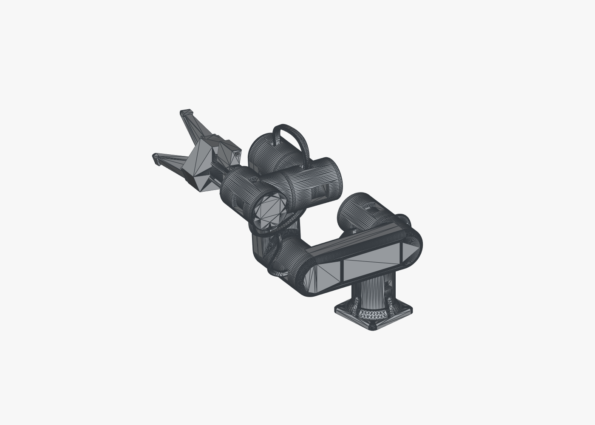
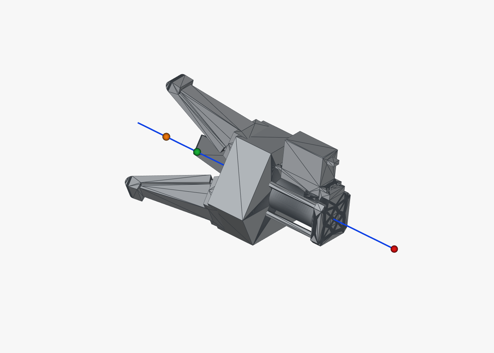
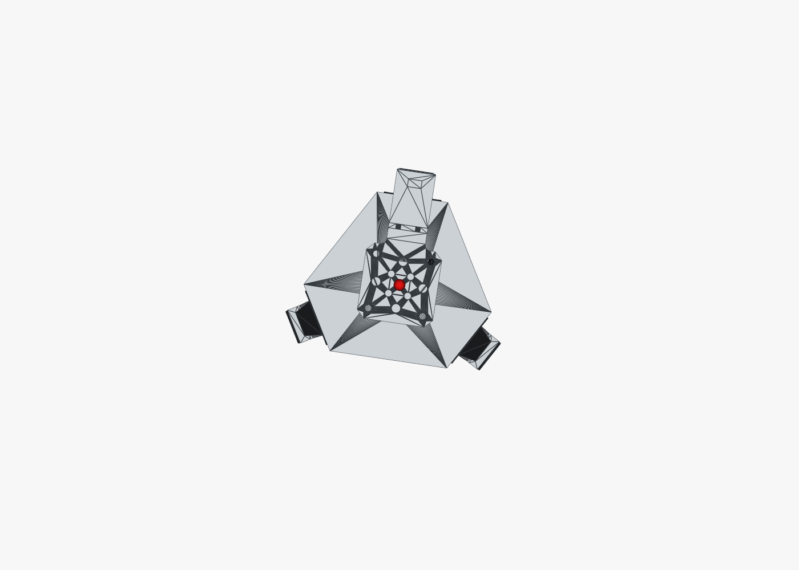
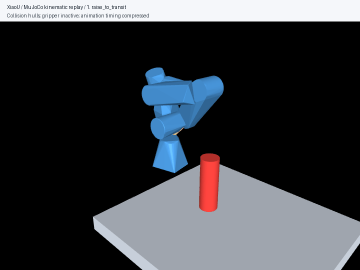
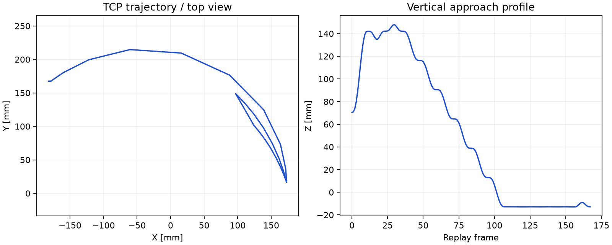
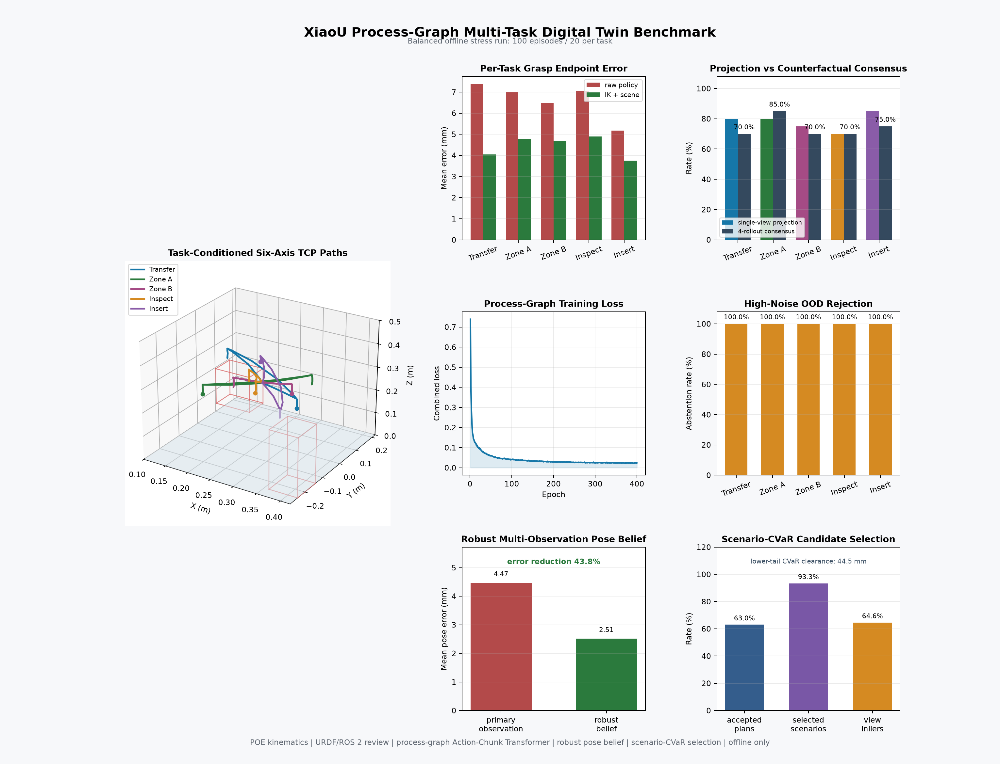

# 小U成果图册

[源码与使用说明](../README.md) · [下载完整成果包](https://github.com/1830051801-ux/xiaou-vision-robot-arm/releases/tag/consolidation-20260920)

## 六轴结构

整机 STEP、29 份去重后的模型与渲染文件随 `xiaou-mechanical-models.zip` 提供。ROS 2 使用的轻量视觉网格和碰撞网格直接位于源码中。模型导出使用毫米，URDF 缩放为 `0.001`。

<table><tr><td></td><td></td></tr></table>

## 接近示教位的分阶段回放

这次生成了抬升、过渡、下降和侧向接近等 14 个阶段，共 168 个展示帧。动画使用真实工程碰撞网格的凸包、示教关节目标和近似圆柱物体；回放时间经过压缩，关节位置按规划直接指定。夹爪未驱动，物体没有被实际提起。

新回放使用 MuJoCo 3.10.0。报告保留了三组模型自碰接触对，因此不能作为“无碰撞抓取成功”的证明。完整接触记录见 [本轮报告](evidence/consolidation_20260920/taught-cola.json)，轨迹展示点见 [replay-frames.json](visuals/simulation/replay-frames.json)。

## 数字孪生与学习策略

这是已有的离线训练评测成果，本轮整理没有重新训练或改写指标。过程图策略含 1,321,478 个参数，预测 `32 × 6` 关节动作块。历史名义测试包含 640 个样本，每个任务 128 个；约束投影后的平均抓取端点误差为 4.18 mm，全部任务的投影通过比例为 82.34%。这些指标是数值规划评测，不是真机抓取成功率。

原始结构化结果现已公开：[名义测试](evidence/archived_experiments/digital_twin/process_graph_evaluation_nominal.json)、[偏移条件测试](evidence/archived_experiments/digital_twin/process_graph_evaluation_shift.json)、[多观测压力测试](evidence/archived_experiments/digital_twin/process_graph_belief_stress_nominal_100.json)。

## 成果包

| 附件 | 内容 |
| --- | --- |
| `xiaou-source.zip` | 当前主仓库完整源码、STM32 工程、ROS 2 描述、轻量模型、文档与证据 |
| `xiaou-mechanical-models.zip` | 原始 STEP、静态世界模型、去重 STL、结构渲染与 SHA-256 清单 |
| `xiaou-experiment-assets.zip` | YOLO/ONNX、Transformer 权重及量化资产、数字孪生权重和合成训练/测试集；重复内容通过清单保留别名 |
| `SHA256SUMS.txt` | 下载文件的完整性校验值 |

[205 份历史报告索引与资产映射](evidence/archived_experiments/MANIFEST.json)记录了来源哈希、公开副本哈希和文件别名。本机绝对路径已归一化；一份扩展名为 JSON 的控制台日志未当作 JSON 结果发布，原文件仍留在本地。

## 本轮验证

| 范围 | 结果 |
| --- | --- |
| Pi 软件与协议单元测试 | 130 项通过 |
| 导入的数字孪生测试 | 51 项通过；修复缺失的本机测试夹具依赖 |
| 发布结构 | 模型登记、Keil 文件引用和默认运动锁检查通过 |
| MuJoCo 可视化 | 14 阶段回放与 PNG/GIF 成功生成；接触记录完整保留 |

配套的语言条件分拣与 ROS 2 工作单元见 [PickSort-VLA](https://github.com/1830051801-ux/picksort-vla)。
