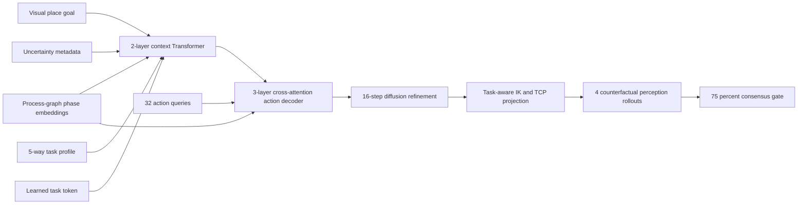

# Process-Graph Multi-Task Action-Chunk Transformer Benchmark

## Objective

This experiment evaluates whether a task-conditioned and process-graph-conditioned trajectory policy can generate useful offline six-axis action chunks across multiple process templates while preserving explicit kinematic and scene safety checks. It also evaluates counterfactual perception consensus before marking a preview robust. It is a digital-twin benchmark, not authorization for physical movement.

## Task Suite

| Task profile | Offline process template | Additional condition |
| --- | --- | --- |
| `transfer` | approach, contact, transfer, retreat | general target-to-target transfer |
| `sort_zone_a` | faster approach, contact, transfer, retreat | simulated placement-zone A boundary |
| `sort_zone_b` | conservative approach, contact, transfer, retreat | simulated placement-zone B boundary |
| `inspection_scan` | approach, view one, retreat, view two, retreat | two-view scan path |
| `precision_insert` | approach, contact, transfer, final dwell, retreat | tighter simulated placement region |

The zone names are benchmark labels, not claims about calibrated physical bins. Every retained trajectory is checked by the same TCP scene clearance rules.

## Data Generation

The generator samples grasp and place configurations inside the assumed joint envelope, obtains Cartesian poses from the checked-in six-axis POE model, and filters targets through the diagnostic workspace and task-profile region. For each accepted contact pose it creates a Cartesian vertical approach pose, solves it with multi-start damped least-squares IK, and builds a 32-step process trajectory through task-specific anchor times.

The 26-dimensional model context contains:

1. visual grasp position and rotation-6D: 9 values;
2. visual place goal position and rotation-6D: 9 values;
3. confidence, XY noise scale, and yaw noise scale: 3 values;
4. five-way task profile one-hot encoding: 5 values.

The training split applies declared visual-noise scaling in `[0.55, 1.45]` and confidence sampling in `[0.68, 0.99]`. The task scheduler is balanced at acceptance time so sparse templates cannot disappear from the training distribution.

## Model

The `process_graph_multitask_action_chunk_transformer_diffusion` checkpoint uses 1,321,478 trainable parameters at `hidden_dim=128`.

1. Three visual/uncertainty projections, one task-profile projection, and a learned task token form five context tokens.
2. A two-layer Transformer encoder fuses the context tokens.
3. A deterministic task process graph assigns every action step one of six explicit phases: home, approach, contact, transfer, retreat, or dwell. A learned phase embedding is added to the action tokens; precision insertion retains a final dwell phase.
4. Thirty-two learned six-axis action queries cross-attend to the context through a three-layer Transformer decoder and predict a trajectory proposal.
5. Noisy joint-state tokens with timestep and phase embeddings use the same decoder to predict diffusion noise over the entire `32 x 6` action chunk.
6. Inference begins from the learned proposal and runs 16 denoising steps before the safety projection stage.



## Constraint Projection

Each sampled action chunk is handled by a deterministic offline shield:

1. reject a visual context outside the normalized training support;
2. reject excessive multi-sample grasp-state dispersion;
3. recover grasp and place poses with multi-start bounded IK;
4. rebuild the task-specific approach/contact/retreat process trajectory;
5. enforce the assumed joint envelope and review TCP clearance against table and fixture keep-out boxes;
6. emit a projected-safe preview or an explicit rejection reason.

No stage opens CAN, serial, ROS 2 hardware, or a physical-arm command path.

## Counterfactual Safety Consensus

The normal projection gate evaluates one declared visual observation. The counterfactual layer adds a second, more conservative decision: it generates four re-observations around that input using half of the declared sensor-noise scale, runs a fresh policy sample and full constraint projection for each, then accepts an offline preview only when at least three of the four rollouts are projected safe. The report preserves both the safe-rollout fraction and failure-reason counts. This turns perception uncertainty into an auditable decision threshold rather than a descriptive confidence value.

## Reproducible Run

The current reference run used the local CUDA PyTorch environment:

| Split | Episodes | Task balance | Visual condition |
| --- | ---: | --- | --- |
| Train | 4,096 | 820 transfer, 819 for each remaining task | 0.55-1.45x domain randomization |
| Nominal test | 640 | 128 per task | XY 3 mm, Z 2 mm, yaw 2 deg |
| Shift test | 640 | 128 per task | XY 8 mm, Z 4 mm, yaw 5 deg |

| Task | Raw endpoint error | Projected endpoint error | Projected-safe coverage | 4-rollout consensus | Shift OOD abstention |
| --- | ---: | ---: | ---: | ---: | ---: |
| Transfer | 6.82 mm | 4.19 mm | 83.59% | 79.69% | 100.00% |
| Sort zone A | 6.59 mm | 4.12 mm | 84.38% | 83.59% | 100.00% |
| Sort zone B | 6.07 mm | 4.40 mm | 78.13% | 71.88% | 100.00% |
| Inspection scan | 6.04 mm | 4.19 mm | 82.03% | 78.13% | 100.00% |
| Precision insert | 6.25 mm | 4.02 mm | 83.59% | 80.47% | 100.00% |
| **Overall** | **6.35 mm** | **4.18 mm** | **82.34%** | **78.75%** | **100.00%** |

```powershell
powershell -ExecutionPolicy Bypass -File .\tools\run_constraint_diffusion.ps1
```

## Simulation Scope and Limits

- Kinematics are based on the checked-in POE model, which is statically checked against the ROS 2 URDF; the benchmark does not use measured production calibration.
- Scene review is TCP-only. Full-link collision, fixture CAD accuracy, and actuator dynamics require a calibrated MuJoCo/Isaac or MoveIt collision workflow before real deployment.
- The task suite measures task-conditioned offline planning under synthetic perception noise; it is not a pretrained VLA benchmark and does not establish real-world generalization.
- Hardware motion remains locked behind the existing readiness gate.
