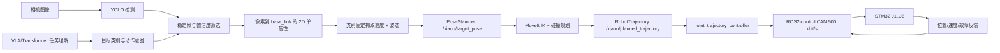

# XiaoU 六轴机械臂算法、方向与通信交付文档

日期：2026-08-05  
工程根目录：`C:\Users\ZhuanZ（无密码）\Desktop\桌面整理_2026-07-01_033319\raspi_robot_ai`

## 1. 交付边界

本次交付覆盖：六轴运动学模型、URDF/POE 一致性、2D 相机目标定位、YOLO 目标筛选、
物品类别固定抓取高度、MoveIt 碰撞规划、ROS2 接口、ROS2-control 硬件插件、
自定义 500 kbit/s CAN 协议、方向规划和安全锁。

本次没有做、也不能从 CAD 或代码猜出的内容：实机 CAN 抓包、真实节点 ID 确认、编码器
零位、正负方向、机械限位、急停响应、负载/电流参数和实际闭环误差。当前配置保持
`motion_enabled=false`，不能把离线通过理解为可以直接运行真实机械臂。

## 2. 总体数据流



VLA/Transformer 目前应作为高层任务解析器：输出目标类别、抓取/放置意图和允许的
动作模式；几何坐标、IK、碰撞检查和底层 CAN 不交给模型自由生成。未接入模型时，
`target_class` 参数仍可用于确定性测试。

## 3. 六轴方向图

以下是根据 `arm_model.json` 的空间螺旋轴和 URDF 零位姿态得到的**模型方向**，用于
规划和标定起始假设，不是实机编码器方向结论。正方向采用右手定则。

```mermaid
flowchart TB
  B[base_link\nJ1 axis +Z]
  B -->|J1: +Z 绕基座竖直轴| L1[link_1]
  L1 -->|J2: +Y| L2[link_2]
  L2 -->|J3: +Y| L3[link_3]
  L3 -->|J4: +Y| L4[link_4]
  L4 -->|J5: (-0.999699, 0, -0.024534) ≈ -X| L5[link_5]
  L5 -->|J6: (0.000416, 0.999856, -0.016969) ≈ +Y| L6[link_6]
  L6 --> T[grasp_tcp / tip_tcp]
```

### 3.1 方向和正负号表

| 关节 | 模型空间轴（零位近似） | 规划意义 | 实机必须确认 |
|---|---|---|---|
| J1 | `(0, 0, +1)` | 从上看绕基座 Z 轴 | 编码器增加是否等于模型正转 |
| J2 | `(0, +1, 0)` | 肩部俯仰 | 电机/编码器方向、零位 |
| J3 | `(0, +1, 0)` | 肘部俯仰 | 电机/编码器方向、零位 |
| J4 | `(0, +1, 0)` | 腕部俯仰 | 电机/编码器方向、零位 |
| J5 | `(-0.999699, 0, -0.024534)` | 腕部滚转，主要为 -X | 安装倾角造成的实际轴向 |
| J6 | `(0.000416, 0.999856, -0.016969)` | 末端旋转，主要为 +Y | 法兰安装和编码器正方向 |

不要把表中的 `+1` 直接写进最终标定文件。实测后使用：

```text
physical_command = direction * (ros_target - zero_offset)
ros_feedback      = direction * encoder + zero_offset
direction ∈ {-1, +1}
```

### 3.2 实机方向标定顺序

1. 断开末端负载，确认机械急停可触发且有人在旁边。
2. 只使能一个关节，速度设为最终上限的 5% 以下，目标变化不超过 2°～5°。
3. 发送正方向小步进，观察机械实际方向和编码器反馈增量。
4. 方向相反则记录 `-1`，方向一致记录 `+1`；不要通过修改 URDF 掩盖接线错误。
5. 把机械参考姿态的编码器读数记录为 `zero_offset_rad`，重复回到参考姿态至少三次。
6. 用硬限位/软限位逐步逼近，记录保守的 `position_min_rad`、`position_max_rad`。
7. J1 到 J6 全部完成后，再做两轴低速联动；任何一步急停异常都保持锁定。

## 4. 机械模型与坐标系

### 4.1 坐标系约定

- `base_link`：基座坐标系，单位米，右手系。
- `link_1`～`link_6`：每个关节后的刚体坐标系。
- `grasp_tcp`：夹爪抓取参考点，MoveIt 规划末端。
- `tip_tcp`：夹爪尖端参考点，用于几何检查。
- 相机输入只提供桌面平面上的 `(x,y)`；`z` 使用 `table_z_m + grasp_height_m_by_class[class]`。

### 4.2 URDF 关节原点和轴

| 关节 | origin xyz（m） | URDF 局部轴 |
|---|---|---|
| J1 | `(0, 0, 0)` | `(0,0,1)` |
| J2 | `(-3.55e-8, 0, 0.155999957)` | `(0,1,0)` |
| J3 | `(0.179999609, -5.34e-10, 0.000367475)` | `(0,1,0)` |
| J4 | `(0.009787295, 0, 0.179733752)` | `(0,1,0)` |
| J5 | `(-5.6e-11, 0.093, 2.27e-9)` | `(-0.999698994,0,-0.024534089)` |
| J6 | `(0.105968179, -6.7e-11, 0.002600614)` | `(0.000416436,0.999855935,-0.016968653)` |

TCP 固定变换：`grasp_tcp` 的 xyz 约为 `(-0.0000864, -0.2074701, 0.0035210)` m；
`tip_tcp` 的 xyz 约为 `(-0.0000999, -0.2398819, 0.0040711)` m，二者的 rpy 为
`(1.55382686, 0, -0.00041650)` rad。最终夹爪安装后仍应实测 TCP 偏差。

### 4.3 POE 计算

模型使用空间螺旋轴 `S_i=[ω_i;v_i]`，正运动学为：

```text
T(θ) = exp([S1]θ1) exp([S2]θ2) ... exp([S6]θ6) M
```

代码中的 `fk_space`、`jacobian_space`、阻尼最小二乘 IK 和带限位线搜索位于
`robot_ai/arm_control/kinematics.py`。IK 同时检查姿态误差和位置误差，并对每一步
施加最大关节步长；没有收敛时不会生成可执行动作。

## 5. 视觉与目标姿态

1. 相机发布 `sensor_msgs/Image`，默认 `/camera/image_raw`。
2. YOLO 只负责候选框和类别；选择同类中置信度最高、面积次高的候选。
3. 默认连续 5 帧稳定，中心最大离散不超过 18 px；不稳定则不发布目标。
4. 像素 `(u,v)` 经 `workspace_homography.yaml` 的 3x3 单应性映射为 `base_link` 的
   平面 `(x,y)`，并检查点在标定凸包内。
5. `z = table_z_m + grasp_height_m_by_class[target_class]`；类别高度为 `null` 时锁定。
6. 目标姿态使用夹爪向下的固定滚转 `π` 加物体平面 yaw，消息发布到
   `/xiaou/target_pose`，坐标系必须是 `base_link`。
7. 目标时间戳超过 0.5 s、四元数非单位、坐标非有限或超出标定区域时丢弃。

2D 相机不能直接测出物体真实高度、遮挡深度或抓取力；这些需要类别标定、额外传感器
或人工确认，不能让 VLA 猜测。

## 6. ROS2 / MoveIt 接口

| 接口 | 类型 | 方向 | 说明 |
|---|---|---|---|
| `/camera/image_raw` | `sensor_msgs/Image` | 相机 -> 感知 | 原始图像 |
| `/xiaou/target_pose` | `geometry_msgs/PoseStamped` | 感知 -> 规划 | `base_link` 目标 |
| `/xiaou/target_status` | `std_msgs/String` | 感知 -> UI/日志 | JSON 状态 |
| `/xiaou/hardware_ready` | `std_msgs/Bool` | 硬件安全节点 -> 规划 | 必须为 true 才允许执行 |
| `/xiaou/planned_trajectory` | `moveit_msgs/RobotTrajectory` | 规划 -> 记录/控制器 | 当前默认只发布不执行 |

规划组为 `arm`，末端为 `grasp_tcp`，规划参考系为 `base_link`。当前 pipeline 明确
设置 `allow_trajectory_execution=false`，规划节点默认 `allow_execution=false`；因此
只能验证规划结果，不能绕过硬件安全锁运动。

## 7. XiaoU CAN V1

完整帧定义见 [`xiaou_can_v1_protocol.md`](xiaou_can_v1_protocol.md)。关键约定如下：

- Classic CAN 标准 11 位 ID，DLC=8，500000 bit/s。
- 暂定 J1..J6 节点 ID 为 1..6；命令 ID `0x101..0x106`，反馈 ID `0x181..0x186`，
  诊断 ID `0x1C1..0x1C6`。
- 命令 opcode `0x01`：目标位置 int32 微弧度、目标速度 int16 毫弧度/秒。
- 反馈 opcode `0x81`：位置/速度相同缩放，status 包含 enabled/fault/estop/homed/heartbeat。
- STM32 命令看门狗 200 ms；Pi 反馈看门狗 200 ms。
- 扩展帧、远程帧、错误帧、错误 opcode、错误 DLC 都拒绝。

这是双方待实现和回环验证的自定义接口；`vendor_protocol_reference` 只是历史参考，
不能据此声称与某厂商协议兼容。

## 8. ros2_control 硬件插件

插件：`xiaou_arm_can_control/XiaouArmCanSystem`。

- 导出每个关节 position command、position state、velocity state。
- `write()` 对每个关节检查位置限位，按方向/零位换算并发送命令。
- `read()` 过滤 CAN 帧、解析反馈，遇到 fault/estop 或任一关节反馈超时即返回错误。
- `on_activate()` 在打开 socket 前检查 motion、协议、急停、反馈四项安全条件，并重置反馈看门狗。
- 默认 xacro 使用 `can0` 参数但 `motion_enabled/protocol_confirmed/estop_verified/feedback_verified` 全为 false。

当前不要启动 `can_control.launch.py`，不要配置真实 `can0`，不要把四个安全字段改成 true。

## 9. 配置文件状态

`robot_ai/arm_control/config/hardware_calibration.json` 当前状态：

```text
motion_enabled: false
protocol_confirmed: false
estop_verified: false
feedback_verified: false
joint_node_ids: [1, 2, 3, 4, 5, 6]  # 暂定映射，不等于实测
encoder_zero_offset_rad: [null x6]
encoder_direction: [null x6]
position_min_rad / position_max_rad: [null x6]
velocity_max_rad_s / acceleration_max_rad_s2: [null x6]
```

`object_grasp_profiles.json` 中 pen/cup/cola/bottle/earphone 的抓取高度仍为 `null`，
所以感知节点不会发布可用抓取目标，必须先测量每一类 TCP 高度。

## 10. 已完成的离线检查

- Python 单元测试：20 passed。
- Python `compileall`：通过。
- ROS2 工作区：6 packages finished（此前 Linux/WSL 环境记录）。
- POE 与 URDF：最大螺旋轴误差约 `3.97e-9`，末端 home 位姿误差约 `1.0e-12`。
- 默认 xacro 和 CAN 锁定模式：通过。
- 网格清单：visual/collision 各 8 个非空 STL，manifest 8 个组件。
- 默认规划执行锁：MoveIt 执行关闭、规划节点执行关闭、硬件 ready 必须为真。

复核命令：

```powershell
cd "C:\Users\ZhuanZ（无密码）\Desktop\桌面整理_2026-07-01_033319\raspi_robot_ai"
py -m pytest -q tests
py -m compileall -q robot_ai tests
py tools/verify_six_axis_stack.py
```

完整历史日志：`verification_ros2_20260805_final.log`；离线报告：
`runtime/arm_model_checks/six_axis_verification.json`。

## 11. 解除真实运动锁的唯一条件

只有在以下证据全部具备后，才能单独评审是否修改安全锁：

1. STM32 固件按协议完成，虚拟 CAN/回环测试覆盖正常、超时、fault、estop 和错误帧。
2. J1..J6 实际 ID 与 1..6 的对应关系已逐个记录。
3. 每个关节完成低速小角度方向、零位、软/硬限位和反馈频率标定。
4. 急停实测能够停止所有关节，并且不能自动恢复。
5. 负载、速度、加速度、碰撞间隙和 TCP 抓取高度均有记录。
6. 先单轴，再双轴，再六轴空载，最后才进入带物体流程；全程有人操作急停。

在这些条件之前，本项目的正确结论是“算法和离线接口已准备，真实运动未验证”。

## 12. GitHub 参考与已吸收的改进

本轮只参考公开项目的工程原则，不复制其机器人型号、ID、限位或厂商协议：

- [ros-controls/ros2_control](https://github.com/ros-controls/ros2_control)：硬件组件的
  `read()`/`write()`/生命周期错误应返回硬件错误，并建议用插件加载测试验证接口。当前
  CAN 插件已在读错误、反馈超时、fault/estop 和越限时返回 `ERROR`。
- [ros-controls/ros2_controllers](https://github.com/ros-controls/ros2_controllers)：
  `joint_trajectory_controller` 需要真实 position feedback，并提供 trajectory/goal
  tolerance、停止速度容差和取消时平滑减速能力。当前控制器已导出 position+velocity
  状态；实测后应把每关节轨迹容差、终点容差和停止速度写入 `controllers.yaml`。
- [moveit/moveit2](https://github.com/moveit/moveit2)：其 Ruckig smoothing 测试覆盖
  自定义速度、加速度和 jerk 限制。当前项目的五次轨迹已验证速度/加速度边界；在
  `joint_limits` 和负载实测后，可在 MoveIt 规划后增加 Ruckig 时间参数化，不能用猜的
  jerk 值直接放开实机。
- [UniversalRobots/Universal_Robots_ROS2_Driver](https://github.com/UniversalRobots/Universal_Robots_ROS2_Driver)：
  采用接收超时、停止回调、速度缩放和轨迹状态监测。当前项目已采用同类的反馈超时和
  硬件锁；速度缩放应等得到真实负载和驱动器能力后再加入。
- [ros-industrial/ros2_canopen](https://github.com/ros-industrial/ros2_canopen)：提供
  CANopen 的设备/节点管理范式。当前 STM32 协议是自定义固定帧，不应把 CANopen 的
  PDO/SDO 结构混入现有帧；若以后改用 CANopen，应另起协议版本并重新做固件和回环验证。

### 12.1 当前可继续提高精度的顺序

1. 先测量并记录每关节零位、方向、机械限位、速度/加速度上限和编码器重复性。
2. 在控制器中启用 per-joint trajectory/goal tolerance 和 stopped-velocity tolerance，
   用实测重复定位误差设定，而不是套用示例值。
3. 在 MoveIt 规划输出后采用 Ruckig 或等效 jerk-limited 时间参数化，重新验证每个采样点。
4. STM32 侧加入位置环/速度环的实际采样周期、限幅、积分抗饱和和急停状态机；Pi 侧只
   发送目标与看门狗，不把高频闭环塞进 Python。
5. 用标定点测量 2D 单应性残差、TCP 偏移和每类物体抓取高度；把误差统计纳入目标发布门限。
6. 最后做空载单轴、空载多轴、带载低速和完整视觉流程四级验收，每级都保存轨迹、反馈、
   CAN 错误和急停日志。
