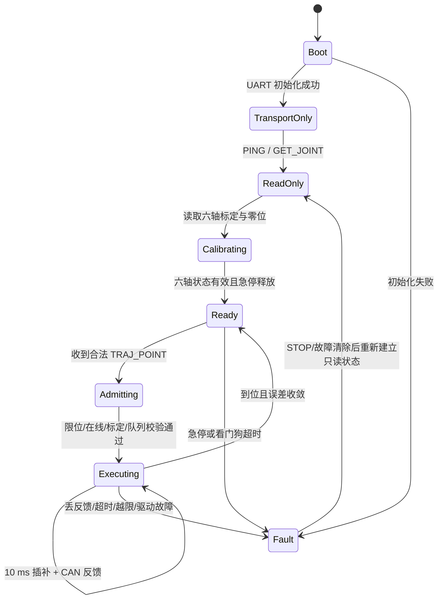

# 小U具身智能桌面服务机器人

## 作品展示级系统技术说明书

**版本**：v1.1  
**日期**：2026-08-16  
**工程根目录**：`D:\机械臂\work\raspi_robot_ai_safety_20260808`  
**系统组成**：六轴机械臂、STM32F407 电控、树莓派边缘计算、桌面 GPU 训练站、ROS 2/MoveIt 2、MuJoCo、YOLO、Transformer/VLA、陪伴式 AI 与 Control Tower 交互界面

> 本文是小U项目的总技术说明书和作品展示底稿。它以当前源码、配置和离线验证产物为依据，同时给出完整目标态架构。所有结论均标注证据等级，避免把仿真结果或源码实现误写成已经完成的真机能力。

---

## 1. 项目定位

### 1.1 一句话定位

小U是一台面向桌面服务场景的六轴具身智能机械臂，也是一名有持续状态、可解释行为和陪伴式表达的桌面 AI。它把人的语音或界面意图转化为目标物理解，经视觉感知、世界模型和 Transformer/VLA 任务决策选择抓取策略，再由确定性的坐标转换、逆运动学和轨迹规划生成可复现动作，最后通过树莓派、UART、STM32F407 和 CAN 总线驱动六个关节完成动作，并用状态塔、语音和表情把机器的判断过程呈现给人。

### 1.2 作品价值

小U不把“能识别一个物体”当作完整智能，而是展示一个闭环系统：

```text
人类意图
  -> 目标理解
  -> 视觉检测
  -> 世界坐标估计
  -> 抓取家族选择
  -> 路径/姿态规划
  -> 轨迹执行
  -> 关节反馈
  -> 任务结果与表情反馈
```

系统的高级感来自职责分层和可解释性，而不是让神经网络直接产生电机帧。AI 负责“理解、陪伴和决定做什么”，ROS 2/MoveIt 或离线规划器负责“找一条可走的路”，F407 负责“按确定的周期和单位实时执行”，电机反馈负责“告诉系统到底做到了没有”。VLA 可以把视觉、语言和动作语义放在同一个任务上下文中，但在小U里仍然只产生任务级候选，不能越过规划、硬件状态和 F407 admission。

### 1.3 目标演示对象

| 对象 | 期望动作 | 当前工程状态 |
|---|---|---|
| 可乐罐/可乐瓶 | 抬升、上方转移、侧向接近、接触、抓取、抬升 | 已有示教侧路线的离线预览和 MuJoCo 回归 |
| 普通瓶子 | 圆柱侧抱 | 已有物体模型和抓取契约，需专用示教与真机标定 |
| 水杯 | 侧向或避开把手的抱取 | 有仿真策略和接口，真实视觉类别尚未补齐 |
| 笔 | 顶部/侧向夹取 | 有专用策略接口，需真实姿态与夹爪测量 |
| 桌面小物 | 由上向下平夹 | 有统一任务接口，需按物体尺寸建立示教族 |
| 抽纸巾 | 夹住边缘后沿桌面方向拉取 | 有刚性叠层代理仿真，柔性物理和真实夹持仍待验证 |

---

## 2. 设计理念

### 2.1 五层协同

1. **机械层**：提供刚度、工作空间、末端姿态和可维护的连接接口。
2. **电控层**：提供实时闭环、CAN 通信、故障处理、限位和轨迹执行。
3. **智能层**：提供视觉检测、世界模型、任务决策和动作族泛化。
4. **陪伴层**：维护小U的身份、短期任务记忆、长期偏好、情绪状态和对话连续性。
5. **交互层**：把状态、意图、阻断原因和结果清楚地呈现给用户。

任何一层都不越权：视觉不直接发电机命令，Transformer/VLA 不直接发 CAN，陪伴层不伪造事实，ROS 2 不绕过 F407 实时控制，UI 不伪造硬件在线状态。

### 2.2 两台计算机的职责

| 设备 | 主要职责 | 不承担的职责 |
|---|---|---|
| 桌面 GPU 工作站 | YOLO 训练、Transformer 训练、MuJoCo 批量仿真、模型导出和回归 | 真实电机实时闭环 |
| 树莓派（2 GB RAM） | 相机采集、轻量 ONNX 推理、意图编排、ROS 2/Pi 侧桥接、UART 通讯、状态呈现 | PyTorch 训练、MuJoCo 大规模仿真、保存大模型训练环境 |
| STM32F407 | UART 协议解析、状态机、CAN 总线、电机命令、反馈采集、轨迹 FIFO、看门狗 | YOLO、Transformer、复杂路径搜索 |

### 2.3 证据分级

本文所有进度使用四级标签：

- **实机已验证**：有当天硬件输出或实机动作日志作为证据。
- **离线/仿真已验证**：在 Windows、回放或 MuJoCo 中可复现通过。
- **源码实现，待上机**：接口和代码已存在，但缺少真实设备证据。
- **目标完成态**：作品最终希望达到的完整能力，不能当作当前事实。

---

## 3. 总体架构


### 3.1 端到端数据流

1. 用户说“拿可乐”或在界面选择对象。
2. 意图模块将自然语言归一化为 `target_class`、任务类型和动作约束。
3. YOLO 输出类别、置信度、像素框和中心点；当前注册表提供高召回与高精度两个显式 profile。
4. 标定层把像素坐标转换到 `base_link`，并根据物体类别、尺寸和桌面高度补足目标 Z 与姿态。
5. 世界模型记录桌面、物体、机械臂关节快照、末端目标和当前阶段。
6. Transformer/VLA 读取最多 16 帧历史、46 维观测和用户任务语义，输出策略、阶段、6 个有界动作参数和风险值。
7. ROS 2 节点将决策转成目标 Pose、候选轨迹和规划状态；MoveIt 负责规划审查或执行前预览。
8. 确定性轨迹层将目标变成 `TRAJ_POINT` 序列，`duration_ms` 表示该点的同步段时间。
9. Pi 通过 UART 将请求交给 F407；F407 校验状态、限位、标定和队列后，按 10 ms 插补周期向 CAN 发送关节目标。
10. 反馈沿 CAN -> F407 -> UART -> Pi 反向回传，交互层显示在线、新鲜度、阶段和结果。
11. 陪伴层根据用户意图、任务结果、历史偏好和当前硬件状态生成自然语言、表情和下一步建议；它只消费事实状态，不把规划候选说成已完成。

---

## 4. 机械系统

### 4.1 机械臂本体

小U采用六个旋转关节。J1 负责底座回转，J2/J3 负责肩部和肘部的大范围伸展，J4/J5/J6 负责腕部姿态和末端方向。末端采用可更换工具接口，当前项目以夹爪 TCP 为抓取参考，同时保留末端尖端 TCP 供工具和仿真切换。

CAD 来源为用户提供的总装 STEP。离线提取结果已经与 POE、DH 和 URDF 进行数值交叉核对，说明几何模型内部一致；它不等同于编码器零位、减速器间隙、真实负载和相机外参已经完成标定。

### 4.2 几何与坐标系

| 项目 | 当前定义 |
|---|---|
| 根坐标系 | `base_link` |
| J1 轴 | `base_link +Z` |
| J2/J3/J4 轴族 | 以 `+Y` 为主的肩肘轴系 |
| 抓取 TCP | J6 轴中心沿工具方向约 207.5 mm |
| 尖端 TCP | J6 轴中心沿工具方向约 239.9 mm |
| 单位 | ROS 2 使用 m/rad；电机反馈和示教文件使用 deg/rpm/Nm |
| 物体坐标 | `base_link -> object_<id>` TF 或等价 PoseStamped |

重要约束：抓取 TCP 的方向矩阵来自 CAD 几何拟合，不能用未经验证的 `RPY(pi,0,yaw)` 简化姿态替代真实工具姿态。

### 4.3 CAD 派生尺寸

| 几何量 | 数值 |
|---|---:|
| J1 到 J2 轴向距离 | 156.0 mm |
| J2 到 J3 轴距 | 180.0 mm |
| J3 到 J4 轴距 | 180.0 mm |
| J4 到 J5 法向偏移 | 93.0 mm |
| J5 到 J6 轴向距离 | 106.0 mm |
| J1 到 J6 home 直线距离 | 459.2 mm |
| 抓取 TCP 几何距离 | 207.5 mm |
| 尖端 TCP 几何距离 | 239.9 mm |

上述数据是模型参数，不是承载能力指标。真实设计评审还需要补充材料、质量、重心、减速器额定扭矩、线缆弯曲半径和末端负载曲线。

### 4.4 当前软件工作范围

当前候选配置和 STM 源码工作范围统一为距已记录物理极限约 5° 的可用窗口：

| 关节 | 最小角度 | 最大角度 | 说明 |
|---|---:|---:|---|
| J1 | -165° | 165° | 软件工作包络 |
| J2 | -125° | 125° | 与 F407 effective limit 必须一致 |
| J3 | -135° | 135° | 与 F407 effective limit 必须一致 |
| J4 | -175° | 175° | 与 F407 effective limit 必须一致 |
| J5 | -85° | 115° | 重点检查腕部和线缆余量 |
| J6 | -175° | 175° | 当前实时反馈仍需上机确认 |

这是“宽泛但不贴实体端点”的工程工作范围，不是鼓励撞到极限。Pi 配置和 F407 `JOINT_EFFECTIVE_*` 列表必须保持同一版本、同一单位和同一关节顺序。

### 4.5 机械设计必须关注的细节

- 末端夹爪连接面要以 J6 boss-side 接口为准，不能把 PCD36/PCD48 孔阵列直接当成工具 mating face。
- 线缆应沿 J2/J3/J4 运动包络布置，记录最小弯曲半径和松弛长度；线缆干涉往往比理论碰撞更早发生。
- 机械限位、软件限位和规划限位需要三份独立证据：实体端点、F407 effective limit、MoveIt joint_limits。
- 末端抓取演示优先使用轻、小、规则物体；真实抓取时必须记录夹爪开度、接触点、载荷和滑落情况。
- 机械结构、驱动器和电源必须按“空载、轻载、最大演示载荷”分别验收，不用仿真的惯量表直接替代真实电机热和扭矩数据。

### 4.6 结构功能岛与可维护性优势

结构资料进一步明确了小U的四个功能岛：机械执行区、独立感知区、电控/收纳区和纸巾/物料区；小U屏幕与云台作为独立的情感交互模块架设在上视角结构上。这个布局让相机不必随腕部高速运动，减少了随动线缆和视场变化；让电控、收纳和耗材可以从机械运动包络中分离，便于拆装、检修和产品换壳。

- **模块化节段**：电机、法兰、关节壳体和连杆按可拆分节段组织，便于替换单节、检查紧固件和扩展末端工具。
- **内刚外柔**：承力骨架承担刚度，圆角 ABS 外壳和保护性蒙皮负责外观、触感和轻量防护；两者的设计目标不混为一谈。
- **走线可见**：J2/J3/J4 运动包络外设置走线通道与固定点，量产前必须补记最小弯曲半径、松弛长度和疲劳次数。
- **感知与交互独立**：上视角相机、屏幕和云台具有独立安装/更换边界，方便做不同桌面场景和品牌主题的版本化配置。

这些是结构设计优势和工程方向，不等同于已经完成的承载、寿命、跌落、温升或安全认证。最终验收仍以 BOM、装配公差、实测载荷和连续运行数据为准。

---

## 5. 电控与嵌入式系统

### 5.1 电控分层

```text
24 V 电源 / 保险 / 急停
        |
        +--> 六轴驱动器与电机（CAN 总线）
        |
        +--> STM32F407 控制板
                    |
                    +--> UART 与树莓派
                    +--> CAN 收发器
                    +--> 急停/使能/故障输入
                    +--> 状态、看门狗、轨迹 FIFO
```

Pi 是任务编排和边缘推理设备，不是电机实时控制器；F407 是唯一允许把高层轨迹变成实时 CAN 电机命令的控制边界。

### 5.2 UART 物理链路

| 项目 | 规格 |
|---|---|
| Pi 端口 | `/dev/serial0` |
| F407 | USART1，PA9=TX，PA10=RX |
| 电平 | 3.3 V TTL，禁止接 5 V |
| 参数 | 115200, 8N1，无流控 |
| 连接 | Pi TX -> F407 RX；Pi RX <- F407 TX；两端共地 |

UART 只负责协议传输和状态返回，不直接提供 CAN 电机闭环。供电、急停和 CAN 必须在断电状态下先检查。

### 5.3 CAN 总线

当前工程约定使用 Classic CAN、11-bit 标准帧、DLC=8、1 Mbps。节点映射为 J1..J6 = 1..6，具体实机 ID 仍须在硬件回归中逐个被动确认。

### 5.4 电源、急停与控制板布局优势

电控资料采用“24 V 主电源 -> 主保险/分线 -> 控制板与六轴驱动”的分层表达，控制逻辑、CAN 信号和高电流执行支路在板级/线束级保持可追溯。急停原型采用接触器断开机械臂动力、控制板保持可诊断供电的思路；正式产品仍需按接触器线圈、触点容量、手动复位、冗余和 EMC 要求重新选型与测试。

- **电源边界清晰**：高电流 24 V 机械臂支路与逻辑控制支路分开保护，便于定位压降、热和干扰问题。
- **CAN 走线有规则**：CAN 收发器靠近接口，TVS、终端和回流路径围绕通信入口布置；最终 PCB 需复核阻抗、回流和共模噪声。
- **急停可解释**：释放急停后不能自动恢复运动；需要人工复位并重新通过 F407 状态、标定和轨迹 admission。
- **板卡可制造**：接口集中在板边，测试点、保险和状态指示保留给装配与出厂治具，减少现场“能通但难修”的问题。

电源架构图、急停回路图和 PCB 布局图属于原型/设计证据，不能表述为安全等级认证或量产 EMC 通过。

| 关节 | 命令 ID | 反馈 ID | 诊断 ID |
|---|---:|---:|---:|
| J1 | `0x101` | `0x181` | `0x1C1` |
| J2 | `0x102` | `0x182` | `0x1C2` |
| J3 | `0x103` | `0x183` | `0x1C3` |
| J4 | `0x104` | `0x184` | `0x1C4` |
| J5 | `0x105` | `0x185` | `0x1C5` |
| J6 | `0x106` | `0x186` | `0x1C6` |

命令帧和反馈帧使用物理单位换算：位置为微弧度，速度为毫弧度每秒；编码器零位和方向必须以单轴实测为准，不能由 CAD 轴方向推断。

### 5.4 F407 启动与工作流程



推荐的每次任务顺序：

1. 上电只初始化通信、状态和故障记录。
2. Pi 发送 `PING`，确认 UART 往返。
3. 逐轴读取 `GET_JOINT`，确认 angle、speed、torque、online 和本地接收时间。
4. 读取或建立 F407 标定状态快照，确认 `zero_valid`、限位版本和时间戳。
5. 轨迹入队时原子检查六轴长度、有限值、限位、急停、反馈和 FIFO 空间。
6. 执行线程以 10 ms 周期插补，把当前段目标转换为每轴 CAN 命令。
7. 任一轴反馈超时、急停、故障或轨迹 admission 不确定，立即清 FIFO、STOP，并把结果标记为 `uncertain`，不能假设动作已经完成。

### 5.5 `duration_ms` 同步轨迹语义

每个轨迹点包含六个绝对角度和一个 `uint16 duration_ms`。段时间是所有关节共享的同步时间，不是单个电机的独立等待时间。

```text
speed_rpm[i] = abs(target_deg[i] - current_deg[i])
               / (duration_ms / 1000.0)
               / 6.0
```

等价写法是：

```text
speed_rpm[i] = abs(delta_deg[i]) * 60000 / (duration_ms * 360)
```

因此六轴同时起步、同时到达。零位移轴不应被强行钳到统一最低转速；低于驱动器稳定转速时，F407 使用轨迹跟踪模式和 10 ms 插补保持同步。Pi 规划时应满足：

```text
duration_ms >= max_i(abs(delta_deg[i]) / max_speed_deg_s[i] * 1000)
```

F407 侧的 quintic 平滑函数用于消除段起止速度突变，但不改变段的绝对时间语义。轨迹 FIFO、`free_slots` 流控、STOP/ESTOP 清队列和 ACK 序号必须形成一个闭环。

### 5.6 电控侧需要长期维护的契约

- 未知 opcode、错误节点、错误长度、坏 CRC 和非法转义必须拒绝且不动作。
- `quick_stop`、硬件急停、内部故障和看门狗超时都必须停止电机输出。
- 故障清除后不能自动恢复运动；必须收到新的、完整、有效的使能和轨迹命令。
- 反馈帧中的位置、速度、状态位、时间戳和故障码必须可追溯。
- J5/J6 的“可控制”不能代替“反馈新鲜且可信”；控制成功、查询成功、在线新鲜度是三个独立字段。

---

## 6. Pi 边缘软件

### 6.1 代码分层

| 模块 | 主要职责 |
|---|---|
| `robot_ai/vision` | YOLO 适配、模型注册、类别 schema、CPU/GPU 推理 |
| `robot_ai/vision_targeting.py` | 稳定帧、像素中心、单应性、目标 Z 和可达性 |
| `robot_ai/decision` | 46 维观测、Transformer、策略校验、INT8/ONNX 回放 |
| `robot_ai/arm_control` | POE/DH/FK/IK、示教位、抓取家族、轨迹、UART、反馈质量 |
| `robot_ai/dialog_emote_bridge.py` | 用户意图、任务状态和表情/语言反馈 |
| `robot_ai/status_dashboard.py` | 只读健康检查、关节新鲜度、阻断原因和事件记录 |
| `tools/` | 离线仿真、协议回放、训练验证、硬件返回预检 |
| `runtime/` | 模型、示教记录、规划结果、验证报告和部署归档 |

### 6.2 Pi 端运行原则

- Pi 只运行 ONNX Runtime、NumPy、Pillow 和系统 OpenCV；不安装 PyTorch、Ultralytics、MuJoCo 和完整训练数据。
- 生产模型、类别 schema、`.names` sidecar 和 SHA-256 作为一个不可分割的发布单元。
- 视觉、决策和状态 UI 可以降频；UART/状态采样线程不能被图像推理阻塞。
- 推理超时只影响候选结果，不应直接触发上一条运动命令继续运行。
- 任务日志同时保存原始观测、决策输出、轨迹计划、UART 序号和最终反馈，便于复盘。

---

## 7. ROS 2 与 MoveIt 2

### 7.1 ROS 2 包职责

| 包 | 职责 | 当前定位 |
|---|---|---|
| `xiaou_arm_description` | STEP 派生 URDF/Xacro、TF 和 RViz 模型 | 几何与可视化基础 |
| `xiaou_arm_perception` | YOLO 检测到 `base_link` 目标 Pose | 感知接口 |
| `xiaou_arm_decision` | Transformer 决策桥 | 任务级策略 |
| `xiaou_arm_moveit_config` | MoveIt 2 规划配置、关节限制、规划器 | 规划审查/仿真 |
| `xiaou_arm_planning` | 目标 Pose、笛卡尔路径和执行门 | 规划编排 |
| `xiaou_arm_simulation` | 桌面物体、TF 和离线场景 | 仿真回放 |
| `xiaou_arm_hardware` | 标定状态和硬件就绪门 | 真实接入前置 |
| `xiaou_arm_can_control` | ros2_control 的 SocketCAN 接口骨架 | 实机接入待验 |

### 7.2 话题与消息合同

| 话题 | 类型/内容 | 作用 |
|---|---|---|
| `/xiaou/target_pose` | `geometry_msgs/PoseStamped` | 已标定的目标位姿 |
| `/xiaou/target_status` | JSON/状态消息 | 类别、置信度、坐标和新鲜度 |
| `/xiaou/decision_observation` | 46 维 JSON/消息 | Transformer 输入 |
| `/xiaou/decision` | 策略、阶段、动作参数、风险 | Transformer 输出 |
| `/xiaou/hardware_ready` | 布尔与原因 | 执行门输入 |
| `/xiaou/sim/observation` | 仿真观测 | 离线回放 |
| `/xiaou/sim/action_candidates` | 规则候选和策略候选 | 策略对照 |
| `/xiaou/sim/status` | 仿真阶段与结果 | UI/回归 |
| `base_link -> sim_<object>` | TF | RViz/世界模型查询 |

ROS 2 的核心价值是标准化消息、TF、规划和可替换节点；它不是实时电机控制的替代品。Pi 当前真实链路仍以 Pi UART -> F407 -> CAN 为执行主线，MoveIt/ROS 2 先承担规划审查、目标表达和仿真验证。

### 7.3 MoveIt 的边界

MoveIt 2 用于：

- 依据 URDF/SRDF 和关节限制做 FK/IK、路径规划和笛卡尔路径预览；
- 在 PlanningScene 中加入桌面、物体和禁入区进行碰撞审查；
- 输出可追溯的关节轨迹，交给独立的硬件适配层。

MoveIt 不负责：

- 解释 UART 超时、J5 stale 或 F407 标定指纹；
- 直接绕过 Pi/F407 向电机下发未经 admission 的数据；
- 替代真实急停、CAN watchdog 和实体限位。

---

## 8. 视觉感知与世界模型

### 8.1 YOLO 模型策略

项目保留两个显式模型 profile，而非让系统自动猜测：

| Profile | 用途 | 当前类别 |
|---|---|---|
| `high_recall` | 漏检代价高，保留更多候选 | pen / bottle / cola / earphone |
| `high_precision` | 误抓代价高，减少错误候选 | pen / bottle / cola / earphone |

模型注册表同时约束模型路径、类别 schema、SHA-256 和 profile 角色。选择模型不会启用运动，也不会覆盖生产模型。

当前真实图片数据只有四类；`cup` 与 `tissue` 的物理模型和策略接口已经存在，但不能写成视觉模型已经学会。

### 8.2 标定链

```text
像素框中心
  -> 相机内参与畸变修正
  -> 桌面平面单应性 / 深度估计
  -> camera_link 坐标
  -> base_link 坐标
  -> 物体尺寸、朝向、桌面高度
  -> 抓取家族参数
```

旧相机标定已经失效，重新上机时必须至少采集：相机内参、相机到 `base_link` 外参、桌面平面、九点/多点对应关系、实际 TCP 和目标 Z。标定版本必须进入每条任务日志，不能只保存一组无日期的常数。

### 8.3 世界模型

世界模型不是“把一张图存下来”，而是保存当前任务可解释的状态：

```json
{
  "frame": "base_link",
  "target": {"class": "cola", "position_m": [0.28, -0.12, 0.03], "yaw_rad": 0.0},
  "surface": {"type": "table", "height_m": 0.0},
  "arm": {"joint_position_rad": [0, 0, 0, 0, 0, 0], "joint_online": [true, true, true, true, true, true]},
  "task": {"strategy": "side_wrap", "phase": "approach"},
  "provenance": {"camera_calibration": "pending_live_recalibration", "observation_age_ms": 80}
}
```

世界模型的每个字段都应携带来源、时间和置信度。未知字段宁可标记 `unknown`，不要用 ready 位姿或旧标定静默填充。

---

## 9. Transformer、VLA 与任务级决策

### 9.1 输入与输出

当前工程中的 Transformer 读取最多 16 帧历史，每帧 46 维：目标类别、像素中心与置信度、`base_link` 位置/偏航、物体尺寸与质量、六轴位置/速度/在线状态、任务阶段、硬件状态和夹爪状态。它是小U当前可训练、可量化、可回放的任务级决策核心。

模型输出：

- `strategy`：`top_down_pinch`、`side_wrap`、`pen_pinch`、`flat_pick`、`tissue_pull` 或 `reject`；
- `phase`：观察、接近、抓取、抬升、抽取或中止；
- 6 个有界动作参数：目标 XYZ、夹爪开度、闭合宽度和抽取距离；
- `risk` 与候选置信度。

Transformer 只做任务级选择，不输出关节角、PWM、CAN 数据或 UART 字节。所有动作候选都必须经过参数范围、目标可达性、轨迹限位、反馈和硬件状态检查。

### 9.2 VLA 升级接口

VLA（Vision-Language-Action）不是把大语言模型直接接到电机上，而是把“小U看到了什么、用户说了什么、当前任务进行到哪里、它可以选择哪些动作族”组织为同一段多模态上下文。VLA 在目标完成态中负责把模糊指令归一化为结构化任务，例如：

```json
{
  "intent": "pick",
  "target_class": "cola",
  "constraints": ["avoid_table_contact", "use_side_wrap"],
  "dialogue_act": "confirm_plan",
  "candidate_skill": "taught_cylinder_side_v1"
}
```

VLA 的输入可以包括相机图像摘要、YOLO 目标列表、用户语音文本、世界模型、当前任务记忆和系统状态；输出必须受 JSON schema 限制，只允许 `target_class`、`task_type`、`candidate_skill`、`phase_hint`、`clarification`、`reject_reason` 等任务级字段。它不能输出电机角度、CAN 帧、PWM、UART 原始字节，也不能修改限位和急停状态。

| 能力 | 当前状态 | 目标完成态 |
|---|---|---|
| 视觉目标识别 | YOLO 四类真实训练数据 | 多类别、多视角、连续目标跟踪 |
| 语言意图 | 已有语音/文本入口和任务编排 | 自然语言澄清、上下文追问、个性化偏好 |
| 任务决策 | Transformer 合成数据训练与 INT8 回放 | VLA 提供任务语义 + Transformer/规则提供稳定动作选择 |
| 动作执行 | 确定性轨迹 + F407 实时层 | 仍保持同一执行边界，不让 VLA 越权 |

这使小U在展示上具有 VLA 的多模态理解能力，在工程上保留机械臂必须具备的确定性和可复现性。

### 9.3 训练与量化

当前训练数据来自可解释的合成场景规则，训练和导出链已跑通：CUDA 训练、FP32 ONNX、动态 INT8 ONNX、PyTorch/ONNX Runtime 回放。INT8 模型约为 FP32 部署文件的 36.5%，适合树莓派 2 GB 环境。

这证明的是网络、导出和消息合同正确，不是现实抓取泛化率。下一阶段应把真实相机观测、真实关节反馈、夹爪结果和失败原因加入数据集，再做微调和盲测。

### 9.4 策略与确定性规划的关系

```text
Transformer: 选择“侧抱/顶抓/抽取/拒绝”
规则与 MoveIt: 生成具体 Pose、waypoint 和轨迹
F407: 以固定周期执行轨迹并监控反馈
```

策略网络永远不能通过“高置信度”绕过碰撞、限位或反馈门。对于未知类别、柔性物体或标定失效，正确输出是 `reject` 或 `blocked`。

---

## 10. 抓取动作族与示教泛化

### 10.1 动作族注册

| 动作族 | 适用对象 | 关键参数 |
|---|---|---|
| `taught_cylinder_side_v1` | 可乐类圆柱 | 半径、高度、桌面高度、侧向接近姿态 |
| `dedicated_cylinder_side_v1` | 普通瓶子/水杯 | 专用接触姿态、把手方向、侧向间隙 |
| `dedicated_pen_pinch_v1` | 笔 | 笔轴偏航、长度、半径、顶部接触姿态 |
| `dedicated_flat_pick_v1` | 桌面小物 | 长宽高、顶部接触姿态 |
| `dedicated_tissue_pull_v1` | 抽纸巾 | 边缘接触、拉取方向、距离、柔性参数 |
| `reject_flexible_v1` | 耳机等易变形物 | 暂不抓取，要求单独设计 |

### 10.2 可乐侧向抓取路线

当前离线路线不是从 ready 位姿平移到接触点，而是：

```text
ready
 -> 抬升
 -> 上方转移
 -> 上方预抓
 -> 分段下降
 -> 四段侧向接近
 -> 示教接触
 -> 抓取后抬升
```

最新离线记录共 14 个阶段、约 38.385 s，J6 约变化 20.3°；MuJoCo 回放显示目标物体只在最终接触段发生接触，前 13 段没有提前碰撞。当前 4 个随机种子、8 次局部回归全部通过，CAD 自碰撞为 `record_only` 观察，不能写成完整碰撞证明。

### 10.3 示教到泛化

示教不应只保存六个角度，而应保存：

- `ready`、`raise`、`overhead`、`pregrasp`、`contact`、`lift` 等语义 waypoint；
- 物体类别、尺寸、桌面高度和朝向；
- 夹爪开合命令、最小安全宽度和接触结果；
- 每段的 `duration_ms`、速度上限、插补模式和反馈误差；
- 相机标定版本、世界坐标版本和执行日志。

泛化时只对物体局部坐标和少量姿态参数做变换，再由 IK、轨迹和限位检查重新生成关节路径。不得直接把一组关节角按比例平移到新物体。

---

## 11. MuJoCo 数字孪生

### 11.1 仿真内容

MuJoCo 场景包含六轴机械臂、桌面、可乐/瓶子/水杯/笔/桌面小物/纸巾代理，支持物体位置、偏航、尺寸、质量、摩擦和观测噪声随机化。

仿真主要验证：

- POE/DH/URDF 前向运动学的一致性；
- IK 可达性、轨迹连续性和关节限位；
- 桌面、物体、夹爪接触时序；
- 抓取后抬升和释放后的物体状态；
- YOLO 观测到 Transformer 决策的消息回放；
- 失败原因是否可解释、是否会正确 `reject/abort`。

纸巾当前使用刚性叠层/抽取代理，不能替代真实柔性布料、摩擦和撕裂行为。CAD 网格自碰撞记录为观察项，必须在真正的 PlanningScene 和实际线缆/夹爪模型就位后再做最终碰撞验收。

### 11.2 当前仿真证据

| 验证项 | 结果 | 证据边界 |
|---|---|---|
| 最新侧向示教路线 | 14 阶段、约 38.385 s | 离线规划 |
| 新工作限位 | 全程通过 | 软件模型，不代表实体端点 |
| 随机扰动回归 | 4 个种子 × 2 次 = 8/8 | MuJoCo 离线 |
| 目标接触时序 | 最终接触段才接触 | 场景模型结论 |
| CAD 自碰撞 | `record_only` | 不是完整碰撞证明 |
| 全套专项测试 | 33/33 | 相关专项，不是全项目总测试 |

---

## 12. Control Tower 与小U形象

### 12.1 交互目标

小U的外观和交互不是附加装饰，而是系统可解释性的展示入口。用户需要一眼看出：小U听懂了什么、看到了什么、准备做什么、为什么停下、现在是否真的在线。

### 12.2 小U陪伴式 AI 灵魂

小U的“AI 灵魂”不是一个脱离机械臂的聊天窗口，而是一个与任务、感知和状态一致的陪伴层。它让小U从“收到命令就动作的装置”变为“会解释、会确认、会记得、会在不确定时主动沟通的桌面伙伴”。

陪伴层由四类状态组成：

| 状态 | 保存内容 | 允许影响 | 不能影响 |
|---|---|---|---|
| 身份状态 | 名称、语气、表情风格、称呼方式 | 文案和表情 | 电控参数 |
| 短期任务记忆 | 当前目标、阶段、失败原因、上一次指令 | 追问、任务续接、UI 提示 | 绕过任务前置条件 |
| 长期偏好记忆 | 用户常用物品、演示顺序、语言偏好 | 默认确认语、推荐场景 | 不经确认的真实动作 |
| 情绪状态 | 专注、等待、完成、关切、阻断 | 面部动画、声音节奏、陪伴反馈 | 修改真机状态或伪造成功 |

陪伴 AI 必须遵守“事实优先”：

```text
真实硬件状态 / 规划状态 / 日志  ->  陪伴层可说的话
陪伴层的猜测、情绪、愿望            ->  永远不能反向覆盖硬件事实
```

示例：当 J5 数据过期时，小U应该说“我暂时没有拿到 J5 的新反馈，我先停在这里”，而不是说“我已经抓住了”。当用户说“拿那个”，小U应结合 YOLO 目标列表询问“你指的是左边的可乐还是右边的水杯？”，而不是擅自选择。

### 12.3 状态塔信息结构

1. **任务栏**：当前目标、动作族、任务阶段和预计剩余时间。
2. **感知栏**：YOLO 类别、置信度、坐标系、标定版本和检测新鲜度。
3. **六轴栏**：J1-J6 的在线/离线、角度、速度、扭矩、查询耗时和数据年龄。
4. **规划栏**：当前 waypoint、轨迹段、`duration_ms`、限位余量和接触事件。
5. **硬件栏**：Pi、UART、F407、CAN、急停、标定和反馈门状态。
6. **事件栏**：超时、J5 stale、J6 offline、拒绝原因、STOP 是否确认。

状态词必须区分 `fresh_online`、`stale`、`query_failed`、`offline_reported`、`future_timestamp` 和 `freshness_unknown`，不能把“曾经在线”显示成“当前在线”。

### 12.4 表情状态建议

| 状态 | 表情/动画 | 语言反馈 |
|---|---|---|
| 待机 | 轻微呼吸、目光扫描 | “我准备好了。” |
| 识别 | 目光锁定目标 | “我看到一个可乐目标。” |
| 规划 | 进度环/路径预览 | “我先抬高，再从侧面靠近。” |
| 执行 | 专注表情、阶段进度 | “正在接近，当前第 3 段。” |
| 成功 | 短促庆祝动画 | “已完成抓取。” |
| 阻断 | 冷静提示，不做夸张失败动画 | “J5 数据过期，暂不继续。” |
| 急停 | 红色固定状态 | “已停止，请确认设备状态。” |

外观上建议保留圆润、简洁、可识别的面部屏幕和状态灯；信息密度放在 Control Tower，表情只表达情绪和阶段，不替代工程状态。

---

## 13. 树莓派 2 GB 部署方案

### 13.1 发布拆分

**桌面 GPU 包**：PyTorch、Ultralytics、MuJoCo、训练数据、仿真脚本和评估工具。  
**Pi 推理包**：ONNX Runtime、NumPy、Pillow、系统 OpenCV、UART/ROS2 桥、轻量 UI、模型和类别 sidecar。

Pi 包不携带 `.pt`、PyTorch、训练数据或 MuJoCo。当前静态预算为：系统/ROS2 约 512 MB、推理和服务进程估算约 768 MB，总计约 1.28 GB，保留约 256 MB 余量；这不是树莓派实机 RSS 测量，必须上机复测。

### 13.2 运行策略

- YOLO 使用 320/416 输入、单帧或低频稳定帧，不在 Pi 上运行双路高分辨率模型常驻。
- Transformer 使用 INT8 ONNX，序列长度截断到模型容量，CPU 单线程优先。
- 将摄像头采集、推理、UART、UI 分线程，并限制队列长度，避免内存随任务增长。
- 记录 RSS、温度、推理 p50/p95、UART 往返、CPU 占用和降频状态。
- 模型升级采用版本目录 + SHA-256 + 原子切换 + 回滚，不覆盖正在运行的生产模型。

### 13.3 部署验收

```bash
python3 -m compileall -q robot_ai tools
python3 tools/verify_six_axis_stack.py
bash scripts/verify_pi_environment.sh
```

设备回来后再增加：单进程 RSS、全链 RSS、连续 30 分钟温度/降频、相机帧率、ONNX 延迟和 UART 丢帧率实测。

---

## 14. 验证体系

### 14.1 离线验证矩阵

| 层级 | 检查内容 | 当前结果 | 证据等级 |
|---|---|---|---|
| 机械模型 | CAD/POE/DH/URDF 一致性 | 已核对 | 离线/仿真已验证 |
| IK/轨迹 | 多初值、waypoint、限位、插补 | 相关专项通过 | 离线/仿真已验证 |
| MuJoCo | 多物体、扰动、接触时序 | 最新局部 8/8 | 离线/仿真已验证 |
| YOLO 数据 | 4 类、100 图、292 实例 | 检查通过 | 离线已验证 |
| YOLO GPU | deep mAP50 约 0.970 | 桌面 GPU 复测 | 离线已验证 |
| YOLO CPU | ONNX p50 约 253~265 ms | 桌面 CPU | Pi 待测 |
| Transformer | 合成数据训练/回放 | 策略/阶段 1.0 | 架构离线已验证 |
| Transformer INT8 | FP32/INT8 一致性 | 6/6 场景一致 | 离线已验证 |
| ROS2 合同 | TF、话题、46 维观测、安全门 | 通过 | 源码/离线回放 |
| UART/CAN | CRC、分片、ACK、错误帧 | 回放通过 | 离线协议已验证 |
| Pi 包 | 解包烟测、脚本语法、静态预算 | 通过 | 部署前验证 |
| 真机动作 | 单点示教位曾成功 | 历史证据 | 实机已验证，但不可泛化 |

### 14.2 当前未完成项

- F407 最新限位源码尚未重新编译、烧录和上电验证。
- 当前候选 Pi 配置的 `motion_enabled=false`、F407、反馈和 MCU 标定字段仍未因离线测试而解锁。
- `CMD_GET_STATE` 历史上不稳定；执行器主线使用逐轴 `CMD_GET_JOINT`，但真实反馈新鲜度仍需重新测量。
- J5 曾出现间歇性查询失败；J6 当前实时反馈不能视为已确认。
- 旧相机标定失效；真实相机到 `base_link` 外参、桌面高度和 TCP 接触点未重新确认。
- 真实 `cup/tissue` 视觉标注缺失；夹爪开合、夹持力和成功/滑落数据未闭环。
- Windows 本轮没有真实 ROS 2/DDS/MoveIt 进程启动证据。
- Pi 实机 RSS、温度、FPS 和长时间稳定性没有测量。

---

## 15. 真实硬件回来后的验收顺序

### 阶段 A：只读连通性

1. 断开机械动力或保持物理急停。
2. Pi 运行 PING，记录 ACK 序号和往返时间。
3. 逐轴读取 J1..J6，连续记录角度、速度、扭矩、online、查询耗时和本地接收时间。
4. 单独统计 J5/J6 丢帧、stale、未来时间戳和重试次数。

### 阶段 B：电控被动验收

1. 确认 F407 启动日志、固件版本、限位版本、标定指纹和急停状态。
2. CAN 仅被动监听，逐个确认节点 ID、反馈单位和状态位。
3. 验证 STOP、ESTOP、清 FIFO 和故障恢复；清故障后必须重新授权。

### 阶段 C：单轴与空载

1. 只允许一个轴、小角度、低速、短 duration 的点位。
2. 现场配置急停人员和断电路径，记录正负方向、零位偏差、到位误差、温升和反馈新鲜度。
3. 六轴空载分段执行，确认所有轴同一段同时到达。

### 阶段 D：真实桌面任务

1. 重新做相机标定、桌面平面和实际 TCP 测量。
2. 先做可乐类圆柱，再做瓶子、水杯、笔，最后做纸巾。
3. 每个类别至少记录成功、未接触、滑落、碰桌、反馈丢失和人工中止原因。
4. 只有真实闭环数据足够后，才把示教数据加入 Transformer 微调集。

---

## 16. 明日调试清单

### 必做

- [ ] 保持急停或断开动力，完成 Pi-F407 PING 与逐轴只读健康检查。
- [ ] 确认 J1..J6 CAN 节点 ID、反馈单位和 J5/J6 新鲜度。
- [ ] 记录 F407 固件版本、`JOINT_EFFECTIVE_*` 限位版本和 MCU 标定时间戳。
- [ ] 重做相机内参、相机到 `base_link` 外参、桌面高度和 TCP 接触点。
- [ ] 用可乐空载路线先做规划预览，再做单段、单轴、低速实机动作。
- [ ] 测量 Pi 的 RSS、温度、FPS、ONNX p50/p95 和 UART 丢帧。

### 不要做

- [ ] 不要用旧相机标定直接执行新任务。
- [ ] 不要把 `online=true` 当作实时新鲜反馈。
- [ ] 不要因为 Transformer 置信度高就绕过 MoveIt、限位或 F407 admission。
- [ ] 不要把 `CMD_GET_STATE` 超时改成忽略错误；必要时使用逐轴查询并记录失败。
- [ ] 不要在未知物体、柔性纸巾或 J6 反馈不可信时宣称完成抓取。

---

## 17. 项目目录导航

```text
raspi_robot_ai_safety_20260808/
├─ robot_ai/
│  ├─ arm_control/       # POE/DH/IK、示教、轨迹、UART、反馈质量
│  ├─ vision/             # YOLO、类别 schema、模型注册
│  ├─ decision/           # Transformer、ROS2 合同、量化与回放
│  ├─ dialog_emote_bridge.py
│  └─ status_dashboard.py
├─ ros2_ws/src/
│  ├─ xiaou_arm_description/
│  ├─ xiaou_arm_perception/
│  ├─ xiaou_arm_decision/
│  ├─ xiaou_arm_moveit_config/
│  ├─ xiaou_arm_planning/
│  ├─ xiaou_arm_simulation/
│  ├─ xiaou_arm_hardware/
│  └─ xiaou_arm_can_control/
├─ simulation/            # 桌面场景和离线回归入口
├─ tools/                 # 验证、协议回放、部署检查
├─ runtime/               # 模型、示教、轨迹和证据 JSON
├─ models/                # 推理模型与类别 sidecar
└─ docs/                  # 设计、联调、验收和部署说明
```

---

## 18. 可复现的离线命令

```powershell
cd D:\机械臂\work\raspi_robot_ai_safety_20260808
python -m unittest discover -s tests -v
python -m compileall -q robot_ai tests tools ros2_ws/src
python tools/verify_six_axis_stack.py
python simulation/run_desktop_scenarios.py --scenarios bottle,cup,pen,desktop_item,tissue_pull
```

Transformer GPU 训练、YOLO GPU 训练和 MuJoCo 大批量回归应在桌面虚拟环境中执行；树莓派只执行经过哈希校验的 ONNX 推理包。

---

## 19. 作品展示脚本

### 19.1 90 秒演示

1. 小U待机，表情轻微呼吸，状态塔显示“仅呈现/等待任务”。
2. 用户说“拿可乐”。
3. UI 显示识别框、类别、置信度和目标坐标。
4. 小U说明“我会先抬高，再从侧面靠近，避免平着撞到瓶子”。
5. ROS 2/MoveIt 预览显示上方转移、预抓和分段下降轨迹。
6. F407 状态栏显示 UART、CAN、六轴反馈和轨迹段状态。
7. 机械臂执行侧向接近和抓取；UI 同步显示 `duration_ms`、waypoint 和关节反馈。
8. 成功后抬升，表情切换为完成；失败时显示明确阻断原因和可复现日志编号。

### 19.2 答辩 30 秒简介

小U是一台面向桌面服务的六轴具身智能机械臂。它通过 YOLO 感知桌面物体，把相机坐标转换到机械臂 `base_link`，再由 Transformer 选择侧抱、顶抓或抽取等任务策略，ROS 2/MoveIt 负责目标表达和路径规划，树莓派负责边缘推理与编排，STM32F407 负责确定性的 UART/CAN 实时控制。项目同时建立了 MuJoCo 数字孪生、INT8 边缘部署和 Control Tower 状态呈现，让每一次动作都能被解释、回放和验证。

### 19.3 答辩 3 分钟结构

1. 先展示机械本体和末端工具，说明六轴分工、TCP 和工作范围。
2. 再展示电控框图，说明 Pi 不直接控电机，F407 负责 CAN、反馈、看门狗和轨迹执行。
3. 现场演示目标检测、坐标转换和世界模型。
4. 展示 Transformer 的策略/阶段输出，强调它不直接输出电机命令。
5. 展示 MoveIt/MuJoCo 轨迹，说明先抬升、再转移、再侧向接近的抓取逻辑。
6. 展示状态塔、J5/J6 新鲜度、阻断原因和日志回放。
7. 最后用证据等级矩阵说明哪些已经验证，哪些必须回到真实硬件继续验收。

---

## 20. 商业化与产业化方案

### 20.1 产品定位与目标客户

小U的第一阶段不应直接定位为高负载工业机械臂，而应定位为“低负载桌面具身智能交互平台”。它的核心价值是把多模态 AI、六轴机械、实时电控和拟人交互打包成可展示、可教学、可二次开发的产品。

| 产品形态 | 典型客户 | 核心场景 | 可复制价值 |
|---|---|---|---|
| 科创教育版 | 学校、创客空间、竞赛团队 | AI、ROS 2、机械臂和电控教学 | 标准课程、实验手册、案例库 |
| 展厅互动版 | 科技馆、企业展厅、活动现场 | 语音互动、物品识别、桌面取放、表情展示 | 可替换主题、品牌角色、演示脚本 |
| 开发者版 | 高校实验室、机器人研发团队 | VLA、视觉抓取、数字孪生、真实数据采集 | ROS 2 SDK、示教/回放/日志接口 |
| 轻服务试点版 | 办公桌、康复辅助、服务前台 | 轻小物品递送、桌面整理、提醒交互 | 场景数据和可靠性迭代 |

商业化的关键不是一次性卖出一台机器，而是建立“本体 + 课程/场景包 + 模型更新 + 开发接口 + 维护”的可持续产品组合。

### 20.2 成本与效益分析

下表为工程估算，不引用虚构的供应商报价。实际采购应以 BOM、批量报价、装配工时和合规测试费用为准。

| 成本项 | 原型阶段特点 | 小批量优化方向 | 效益贡献 |
|---|---|---|---|
| 六轴关节与减速驱动 | 单价占比最高，型号和一致性决定精度 | 统一规格、批量议价、备件共享 | 决定运动品质和售后成本 |
| 结构件与夹爪 | 3D 打印/机加工灵活但人工高 | 模块化钣金/注塑外壳、标准紧固件 | 降低装配时间，提高外观一致性 |
| F407/CAN/电源板 | 小批量可用模块，接口易变 | 统一 PCB、线束、测试治具 | 降低返工和通讯故障 |
| Pi、相机、显示和音频 | 算力与交互成本可控 | 部署镜像、标准安装位、统一线束 | 提升演示体验，降低交付时间 |
| 软件、模型和数据 | 前期研发投入大，复制边际成本低 | 模型注册、场景包、OTA/离线升级 | 形成持续服务收入 |
| 测试与售后 | 原型期高度依赖人工 | 自动工装、日志、远程诊断、标准验收 | 降低现场维护成本 |

效益评估建议使用三个可量化指标：单台装配工时、单次演示成功率、故障定位平均时间。与传统“固定脚本机械臂”相比，小U通过目标识别、动作族、数字孪生和结构化日志减少重新编程时间；与纯聊天桌宠相比，它提供可见、可验证的实体行为。

### 20.3 量产可行性

小U已具备模块化量产的方向，但还不是可以无验证直接量产的状态。量产应拆分为五个可替换模块：

```text
机械本体 + 末端工具
F407 控制器 + CAN 线束 + 电源/急停
Pi AI 计算盒 + 相机/屏幕/麦克风
标准软件镜像 + 模型/场景包
校准工装 + 出厂验收脚本 + 日志追溯
```

| 量产要素 | 当前基础 | 量产前必须补齐 |
|---|---|---|
| 机械 | STEP、URDF、TCP 几何和限位候选 | 材料/BOM、寿命、负载、装配公差、线缆疲劳 |
| 电控 | F407、UART/CAN 协议、轨迹/看门狗框架 | PCB 固化、EMC/ESD、电源余量、烧录治具、版本管理 |
| 软件 | Pi 推理包、模型注册、日志与回滚 | 一键镜像、设备注册、异常上报、离线升级流程 |
| 标定 | 坐标模型和示教接口 | 相机/TCP/零位工装、标定 SOP、误差阈值 |
| 质量 | 离线测试、协议回放、部分实机记录 | 出厂 100% 关节、通信、急停、视觉、连续运行验收 |

### 20.4 产业化路线

1. **工程样机**：完成六轴可靠性、实时反馈、夹爪、相机标定和典型抓取闭环。
2. **小批试制**：固化 PCB、线束、外壳和装配工艺；建立序列号、固件版本和出厂日志。
3. **场景产品化**：提供“桌面整理”“饮品递送”“AI 课堂”“展厅互动”四套可切换场景包。
4. **数据飞轮**：在用户授权下收集匿名失败标签、视觉样本和任务日志，用于更新抓取族与模型。
5. **平台化**：开放 ROS 2/SDK、模型 profile、仿真场景和教学实验，让第三方开发更多工具和课程。

---

## 21. 风险控制与可靠性工程

| 风险类别 | 典型问题 | 当前措施 | 量产级改进 |
|---|---|---|---|
| 机械 | 线缆干涉、末端松动、限位碰撞、负载滑落 | CAD/限位候选、示教分段路径 | 疲劳测试、治具、扭矩标记、负载曲线和防松规范 |
| 电源与急停 | 误上电、急停无效、24 V 干扰 | F407 状态机、STOP/ESTOP 语义 | 独立硬件切断、保险、ESD/EMC、急停自检 |
| CAN/UART | 丢帧、CRC 错、ACK 超时、J5/J6 状态不新鲜 | 分片/CRC 回放、逐轴查询、STOP 记录 | 统计看板、链路压测、超时预算、故障注入测试 |
| 标定 | 相机外参漂移、TCP 不准、桌面高度变化 | 标定版本和世界模型接口 | 标定工装、出厂/现场复标流程、误差量化 |
| AI | 误检、未知物、合成训练过拟合、VLA 幻觉 | profile/哈希、`reject`、策略与执行分层 | 真实数据集、盲测、回滚模型、人工确认策略 |
| Pi 部署 | 2 GB 内存不足、温度、降频、模型错配 | INT8、静态内存预算、原子回滚 | 实机 30 分钟压力测试、看门狗、温控和资源配额 |
| 人机交互 | 用户误以为已经执行或已经成功 | Control Tower、状态分级、明确阻断原因 | 强制确认、可视化执行许可、审计日志 |

风险控制的原则是：高层模型允许提出候选，低层系统必须拒绝不可信状态；每个拒绝都要可解释、可记录、可复现。

---

## 22. 相比第二轮作品的改进

第二轮作品的核心闭环是“语音/视觉 -> 坐标转换 -> STM32 固定抓取流程”。当前版本保留这条主线，但从固定任务演示升级为可训练、可验证、可产业化的系统架构。

| 维度 | 第二轮作品 | 当前版本提升 | 证据/边界 |
|---|---|---|---|
| 机械模型 | 以结构展示和固定动作位为主 | STEP -> POE/DH/URDF/TCP 一致性，动作族和工作范围明确 | 几何已离线核对，真实负载待验 |
| 电控 | Pi 坐标帧触发 STM32 固定流程 | UART 帧校验、逐轴反馈、CAN、FIFO、`duration_ms` 同步、10 ms quintic 插补 | 最新固件需烧录验收 |
| 抓取路径 | 主要是固定接近/下探 | 抬升 -> 上方转移 -> 分段下降 -> 侧向接近的语义 waypoint | 侧抓已离线/MuJoCo 回归 |
| 视觉 | YOLO 类别和二维标定 | 双 profile 注册、模型 hash、ONNX 部署、数据集/类别检查 | 真实 cup/tissue 数据待补 |
| 决策 | 规则触发为主 | 46 维 Transformer、INT8、风险/拒绝输出、VLA 接口 | 合成数据验证，不等于真机泛化 |
| ROS2 | 规划概念和基础包 | description/perception/decision/planning/simulation/hardware/can 分包与消息合同 | Windows 未启动真实 ROS2 进程 |
| 仿真 | 数值或单场景验证 | MuJoCo 多对象、随机扰动、接触时序、回放与日志 | 纸巾仍是刚性代理 |
| 陪伴交互 | 语音与表情显示 | 身份、任务记忆、情绪状态、事实优先的陪伴层 | 待接入长期记忆存储 |
| 产业化 | 原型展示为主 | 模块化产品、Pi 镜像、模型注册、出厂验收和场景包路线 | 成本/供应链需按 BOM 落地 |

这些提升的共同点是：把一次能跑的演示，变为有版本、有数据合同、有仿真证据、有部署边界、有故障日志的可迭代产品。

---

## 23. 后续演进路线

### M0：硬件恢复与基线

完成 F407 新固件编译烧录、UART 只读、CAN 被动监听、六轴反馈、急停、标定和限位版本确认。

### M1：真实几何闭环

完成相机标定、桌面平面、实际 TCP、夹爪开合和可乐类侧抱真机回归。

### M2：多对象动作族

为瓶子、水杯、笔、桌面小物和纸巾分别建立物体尺寸、接触姿态、waypoint、夹爪参数和失败标签。

### M3：真实数据决策

将真实视觉、关节反馈、抓取结果和失败原因加入训练集，重新训练/量化 Transformer，并做跨位置、光照和物体外观盲测。

### M4：作品化呈现

完成一键启动、任务回放、状态塔主题、表情动画、演示录像和公开 README/技术附录。

---

## 24. 开源项目参考与文档方法

本文的组织方式参考了成熟开源项目的共同做法：先说明项目解决的问题，再给出架构、模块边界、安装/运行入口、验证证据和贡献/路线图，而不是只罗列 API。

- [ros-controls/ros2_control](https://github.com/ros-controls/ros2_control)：硬件接口与控制器分层、接口契约和可追溯验证。
- [moveit/moveit2](https://github.com/moveit/moveit2)：规划与执行解耦、机器人模型和规划场景组织。
- [google-deepmind/mujoco](https://github.com/google-deepmind/mujoco)：模型、物理仿真、回放和基准证据。
- [ultralytics/ultralytics](https://github.com/ultralytics/ultralytics)：训练、验证、导出和部署分离。
- [ROBOTIS-GIT/turtlebot3](https://github.com/ROBOTIS-GIT/turtlebot3)：模块化机器人项目的包结构和用户文档导航。
- [pollen-robotics/reachy2-sdk](https://github.com/pollen-robotics/reachy2-sdk)：在线/离线能力边界和 SDK 使用说明的表达方式。
- [othneildrew/Best-README-Template](https://github.com/othneildrew/Best-README-Template)：作品展示页的摘要、目录、安装、使用、路线图和参考链接结构。
- [OpenVLA/openvla](https://github.com/openvla/openvla)：视觉-语言-动作模型的任务表达和机器人操作研究参考；小U只借鉴其多模态任务层思想，不把其模型直接接入电机控制。
- [OpenRobotLab/GR00T](https://github.com/NVIDIA/GR00T)：机器人基础模型、模仿学习和数据闭环的研究参考；小U当前仍以可量化的 Transformer 和确定性执行链为实际工程主线。

---

## 25. 最终结论

小U已经具备一个完整作品的技术骨架：机械模型可计算，电控协议有边界，Pi 有边缘部署方案，ROS 2/MoveIt 有规划接口，MuJoCo 有桌面任务和随机回归，YOLO 与 Transformer/VLA 有训练/导出/回放和升级接口，Control Tower 与陪伴式 AI 共同提供可解释的状态、表情和对话呈现。

当前最接近真实演示的主线是“可乐类圆柱侧向抓取”。它已经完成离线规划和局部仿真验证，但真实相机标定、六轴反馈新鲜度、F407 最新固件、TCP/夹爪参数和实机多段轨迹仍需按验收顺序闭环。把这些证据补齐后，小U才能从“完整、可解释、可回放的工程作品”升级为“真实桌面抓取机器人”。
